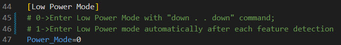

# Avnet RASynBoard Out of Box Application User's Guide
The Avnet Out-of-Box (OOB) application was developed by [Avnet](https://www.avnet.com) and [Syntiant](https://www.syntiant.com/) to showcase the RASynBoard's capabilities and to provide a working application that can be leveraged for custom applications.  This document details the OOB application's features.  

# Major Features
This section outlines the major features of the Avnet RASynBoard OOB application.  See the OOB Feature Configuration section for details on each feature's configuration options and other important feature details.

## Machine Learning (ML) inferencing/feature detection
One of the main hardware features of the RASynBoard is the [Syntiant ndp120](https://www.syntiant.com/ndp120) Nerual Decision Processor.  The ndp120 is a low-power, always-on Audio and Sensor-Fusion device.  The OOB application allows the user to develop and deploy custom ML models without having to modify any source code.

When the ndp120 detects a ML feature in the data it interrupts the RA6 MCU and passes inference data to the OOB application.  The OOB application may perform the following actions for each feature detection event.

1. Illuminate the RGB LED for 500ms with the color associated with the inferencing index 0, 1, 2, . . . (see the ```[LED]``` section below)
1. Optionally send a BLE broadcast message containing the inference information if enabled (see the ```[BLE Mode]``` section below)
1. Optionally send a MQTT telemetry message to the target cloud implementation if enabled (see the ```[Cloud Connectivity]``` section below).

## Data Collection for Developing/Testing New ML Models
Avnet, Syntiant, Renesas and Edge Impulse have all worked together to enable RASynBoard ML model development in [Edge Impulse Studio](https://www.edgeimpulse.com/).  Edge Impulse Studio is a free on-line toolkit that enables data ingestion from development boards that can be used to develop/test/deploy ML models.  Additionally, Edge Impulse will generate the \*.syspkg files that can be used on the RASynBoard with the OOB application.

**Note: RASynBoard Edge Impulse support is scheduled to be released in late October 2023**

**Note: Edge Impulse will release a custom RASynBoard application to interface with the Edge Impulse Studio to develop/test/deploy/test on device in conjunction with the late October 2023 release**

The OOB application also implements multiple ways to collect data from the on-board sensors
1. Audio data can be recorded to the microSD card
1. 6-Axis IMU data can be written to the microSD card and/or streamed to the debug UART
1. (Future enablement) Using additional external sensors

### Flash microSD card images to core board SPI Flash
When developing a RASynBoard ML application it's common to use the microSD card to manage the config.ini and \*.synpkg files.  However if users get to a point where they want to deploy the RASynBoard core board without the I/O board, they can move the config.ini and \*.synpkg files to the on-board SPI flash by pressing the user button for > 3 seconds.  

Once the > 3 second button press is detected the application will . . .
1. Erase the SPI Flash region that holds the config.ini and \*.synpkg files
1. Concatenate all the files into a single binary blob
1. Flash the binary blob to the SPI Flash

Once the images have been moved to SPI Flash, the application will run from SPI Flash if . . .
1. The microSD card is removed from the I/O board
1. The I/O board is separated from the core board


**Note: Use caution when separating and re-attaching the core board from/to the I/O board as the interconnect pins have a fine pitch and are easy to damage.**

**Note: To boot using the config.ini and \*.synpkg files on the microSD card re-connect the two boards and insert the microSD card containing the config.ini and \*.synpkg files.**

## MicroSD Card
The microSD card located on the underside of the I/O board is used for making configuration changes that define how the OOB application operates.  Additionally, sensor data can be recorded to the microSD card and used for ML model training and testing.

### config.ini
The OOB application reads application configuration data from the config.ini file located in the root directory of the microSD file system.  The config.ini file is read on power-up, but also if the card is removed and re-inserted while the OOB application is running.  Using this approach the OOB application can be reconfigured without having to rebuild the application code.

### Syntiant Binary Images
The microSD card is also used to add syntiant binary images that are used by the NDP120.  These files end with the \*.synpkg file extension.  There are three \*.synpkg files for any given ML model.  Using this approach, ML models can be added to the OOB application without having to rebuild the application.  The user defines which \*.synpkg files get loaded onto the NDP120 with config.ini configuration changes (details below).

### Data Recording
The other main use of the microSD card is to capture training data from either the on-board TDK digital microphone, or the TDK 6-Axis IMU sensor. 

1. When audio data is recorded, the application will write \*.wav file(s) to the root directory.  
1. When 6-Axis IMU data is recorded, the application will write \*.csv file(s) to the root directory.

**Note:** Data file names contain a number that is incremented when additional files are written.  It's the users responsibility to remove or delete these files if the microSD card becomes full.

## USB PMSC (USB Mass Storage Driver)
When using the I/O board with a microSD card, the user can access the file system on the microSD card from the development PC.

### Requirements for use the PMSC interface
1. The development PC must be connected to the RASynBoard core board (the smaller board) with a USB-C cable to access the microSD card filesystem. 
2. The OOB application must be running to access the microSD filesystem

**Note: The PMSC Mass Storage Driver is automatically disabled when the OOB application is recording audio, or 6-axis IMU data to the microSD card.  When the recording period ends, the PMSC Mass Storage Driver is automatically enabled and the external drive will enumerate on the development PC.**

**Note: When booting with a blank microSD card, the recording features are automatically disabled.  Copy all the required files to the microSD card and restart the application.  The required microSD card files are included in the GitHub releases (microSD-Files-\<version\>.zip) or from the GitHub repo in the /ndp120/synpkg_files/ directory.  Simply copy all the files to the root directory of the microSD card.**

**Note: The on-board E2-Light debugger interface is only available from the USB-C connector on the I/O board.  It's okay to use both USB-C interfaces at the same time.  One to access the microSD card (core board connector) and one to use the built in E2-Light interface (I/O board connector)**

## Cloud Connectivity
The OOB application currently supports connecting to the Avnet IoTConnect Cloud Solution implemented on AWS.  Future releases will support AWS IoT Core devices and Azure IoT devices.  See the ```[Cloud Connectivity]``` section below for details.

# OOB Feature Configuration
The OOB features are configured by editing the config.ini file located on the microSD card.  When the application starts the config.ini file is read and the application features are configured.  Additionally, the config.ini file is read by the OOB application if the microSD card is removed and re-inserted into the I/O board.

The application will output the current configuration.


## ndp120 Configuration
The ndp120 is configured by identifying the firmware images that will be loaded onto the device.  There are three images referred to as the \*.synpkg files.  These files are usually delivered together and should only be used together. New model files and ndp120 firmware can be copied to the microSD card and configured using the config.ini file.  The application looks for the ndp120 files in the root directory of the microSD card.

There are two areas in the config.ini file to configure which ndp120 files are loaded to the ndp120 at startup.

1. ```[NDP Firmware]-->Mode=x```
    
Use the Mode setting to identify which ```Function_x``` block the application will use when loading the ndp120 firmware images.  The current application identifies 3 Function blocks, however the application is written so that additional Function blocks can be added without having to modify the application.

2. ```[Function_x]``` blocks

Each ```[Function_x]``` block defines a description, and the three required ndp120 images
- ```Description="New Description"```: The description string is output to debug when the models are loaded.  This helps verify that the correct ```[Function_x]``` block is loaded

- ```MCU``` refers to the ARM-M0 firmware that runs on the ndp120.  This firmware manages the devices and data flow.
- ```DSP``` refers to the dsp firmware that runs on the ndp120.  This firmware does data pre-processing plus other functions.
- ```DNN``` refers to the Nerual Network Parameters and ML model.  This firmware implements the ML model.


## LED control
The ```[LED]``` block allows the user to assign different RGB LED colors to each inference index.  When the ndp120 detects a feature in the data the inference results are passed to the application.  The application uses the index of the inference result [0 - n] to identify how to light the RGB LED on the I/O board.  The comments in the config.ini file associate each index with the 5-keyword model, but this feature works with any model that's loaded.  


## Debug Print
The application can be configured to output debug messages to either the UART exposed on the PMOD connector (I/O Board), or the USB-C UART on the core board (the smaller board).  

1. ```[Debug Print]-->Port=x```

- ```Port=1``` Outputs debug to the PMOD connector signals
- ```Port=2``` Outputs debug to the UART associated with the core board USB-C connector
    - This selection allows developers to access debug when the core board is running without the I/O board

**Note the application must bring this UART connection on-line when the application starts.  Because of this delay, most of the startup debug will not be displayed on the UART.**


## Recording Period
The application can record audio or IMU data.

1.```[Recording Period]-->Recording_Period``` defines how long the application collects/records data in units of seconds.
 


## 6-Axis IMU Data Stream Features
The OOB application can capture 6-Axis IMU data either to a \*.csv file on the microSD card, and/or stream data out the debug UART.  

**Note: in order to capture 6-Axis IMU data the active ```[Function_x]``` block must contain ```Button_shift=imu``` within the block.  This is true for any active ```[Function_x]``` block even if the block defines audio detection files.**


**Note: There is currenty a bug if you try to use the circular motion ```[Function_3]``` block to capture 6-Axis IMU data.  If you need to capture 6-Axis IMU data please use the ```[Function_1]``` block.  (AAGBT-82)**

1. ```[IMU data stream]-->Write_to_file=x``` 

- ```[IMU data stream]-->Write_to_file=1``` tells the application to capture IMU data for ```[Recording Period]-->Recording_Period``` seconds when the user button is pressed.  A \*.csv file will be generated and if there are multiple recording events, the filename will contain an incrementing number to distinguish between the different files.  These \*.csv files can be used with the [Edge Impulse Uploader](EdgeImpulseUploader.md) to upload data to Edge Impulse for ML model creation and testing.  
- ```[IMU data stream]-->Write_to_file=0``` disables this feature  

1. ```[IMU data stream]-->Print_to_terminal=x```

- ```[IMU data stream]-->Print_to_terminal=1``` tells the application to stream IMU data to the debug UART for ```[Recording Period]-->Recording_Period``` seconds when the user button is pressed.  This data can be used in conjunction with the [Edge Impulse Data Forwarder](./EdgeImpulseDataForwarder.md) to stream 6-Axis IMU data directly to Edge Impulse.
- ```[IMU data stream]-->Print_to_terminal=0``` disables this feature


## Low Power Mode
The OOB application supports low-power mode.  When in the low-power state, the RA6 device is put into sleep mode, and the DA16600 WiFi/BLE device is held in reset.  The low power mode configuration section defines when the applicatoin enters and exits low power mode.

1. ```[Low Power Mode]-->Power_Mode=x```

- ```[Low Power Mode]-->Power_Mode=0```: When in ```Power_Mode=0``` the application will enter a low-power state when the application detects the "down" \<pause for < 3.6 seconds\> "down" sequence.  The device will stay in a low-power state until any other inference detection event occurs.  When the next event is detected the device will exit the low-power state not enter low-power state again until the "down" \<pause for < 3.6 seconds\> "down" sequence is detected.

- ```[Low Power Mode]-->Power_Mode=1```: When in ```Power_Mode=1``` the application will enter low-power state on power-up and will come out of low-power state when any inference detection occurs.  As soon as the new inference detection logic is completed, the application will automatically re-enter the low-power state.

**Note: The data recording feature is disabled when ```[Low Power Mode]-->Power_Mode=1```**



## BLE Mode

The application can broadcast inference results over BLE that can be displayed on a user interface.  Avnet has a python application that can be used to display the BLE messages.  [Demo GUI Repo](https://github.com/Avnet/Rasynboard_ew23_demo_GUI_qt) (This repo is currently private, we're working on making it public (AAGBT-83))

```[BLE Mode]-->BLE_Enabled=x```

- ```[BLE Mode]-->BLE_Enabled=0```: Disable the BLE functionality (default)
- ```[BLE Mode]-->BLE_Enabled=1```: Enable the BLE functionality


## Cloud Connectivity
The OOB application implements logic to send telemetry to a cloud provider.  The first release connects to the Avnet IoTConnect Cloud solution built on AWS.  In the future, the application will also interface directly with AWS or Azure.  

The current implementation makes a TLS MQTT connection to IoTConnect and sends inference details over MQTT when there is an inference event.

There are multiple configuration items required to establish an MQTT connection.  

### WiFi Access Point Credentials

1. ```[WIFI]-->Access_Point=<Your AP SSID Here>```: Used to set your WiFi access point SSID
1. ```[WIFI]-->Access_Point_Password=<Your AP Password Here>```: Used to set your WiFi Access Point password 


### Target Cloud Provider
The application currently only supports IoTConnect on AWS, however we have feature enhancement tickets written to add AWS and Azure implementations.  The ```[Cloud Connectivity]-->Target_Cloud``` configuration item is used to define which service the device should connect to.  

1. ```[Cloud Connectivity]-->Target_Cloud=x```

- ```[Cloud Connectivity]-->Target_Cloud=0```: No cloud connectivity.  

**Note: If ```Target_Cloud=0``` the application will not attempt to establish a WiFi connection.**

- ```[Cloud Connectivity]-->Target_Cloud=1```: Connect to the Avnet IoTConnect cloud solution on AWS.  See the ```[IotConnect]``` configuration items below to define required details to connect to IoTConnect.  
- ```[Cloud Connectivity]-->Target_Cloud=2```: Connect to AWS (Not currently implemented)  
- ```[Cloud Connectivity]-->Target_Cloud=3```: Connect to Azure (Not currently implemented)  


### IoTConnect
Please see the [IoTConnect](./IoTConnect.md) document for details on how to . . . 
1. Provision Security Certificates to the DA16600
2. Request a trial IoTConnect account
3. Provision a new device on IoTConnect
4. Where to find the configuration details documented below

- ```[IoTConnect]-->Device_Unique_ID=<your device id here>```: Enter the Unique Device ID as defined in your IoTConnect account. - ```[IoTConnect]-->CPID=<your IoTConnect company ID here>```: Enter the 32 character company ID
- ```[IoTConnect]-->Environment=<your IoTConnect environment varaible```: Enter the environment here i.e., poc, prod


