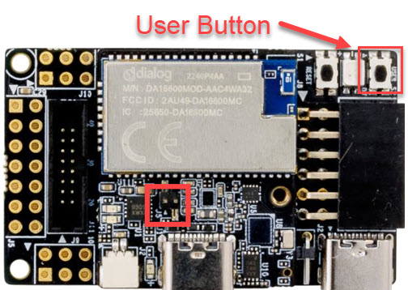
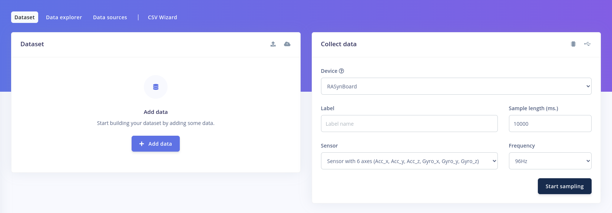
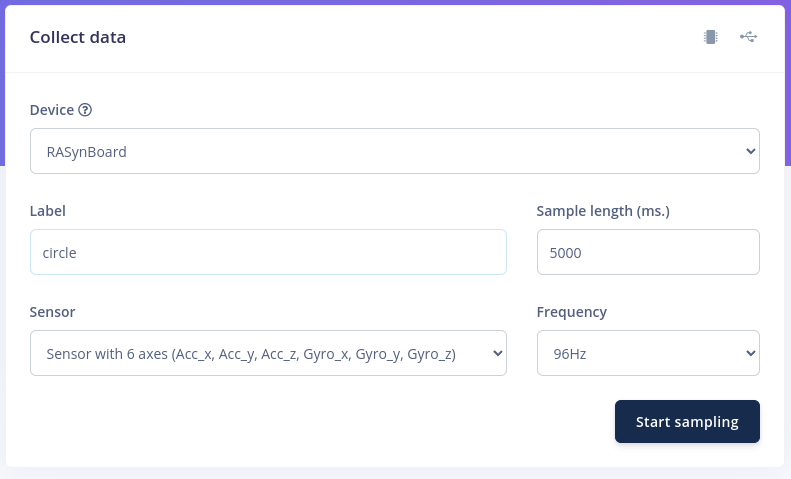
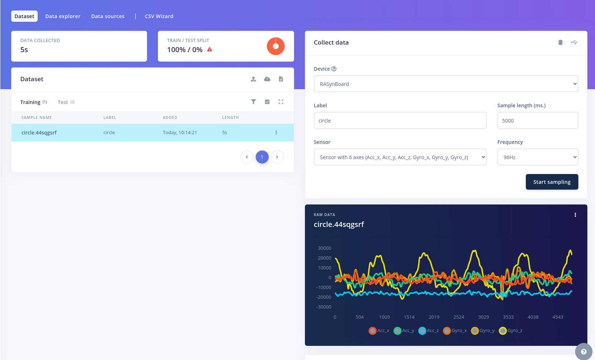

# Using Edge Impulse Data Forwarder

The RASynBoard can be used to collect IMU data and directly feed to to Edge Impulse for training or testing.

## Prerequisites

### Load the RASynBoard OOB Application onto your device
You should have the latest RASynBoard OOB release loaded onto your RASynBoard including the microSD card files associated with the release.

- [Using RASynBoard Releases](./UsingRASynbBoardReleases.md)
    - All the details you need to load the latest OOB tested release onto your board
- [RASynBoard Getting Started Guide](./RASyBoardGettingStarted.md)
    - All the details to clone the OOB repo, build the application and load it onto your RASynBoard

### Install NodeJS with npm
In order to use the data forwarder, you must have NodeJS with npm installed. Please refer to the NodeJS website for installation: https://nodejs.org/en/download/package-manager

Once you have installed NodeJS and npm, install the Edge Impulse CLI tools with the following command:

MacOS/Linux:

```bash
sudo npm install -g edge-impulse-cli
```

Windows:

```Powershell
npm install -g edge-impulse-cli
```

## Setting Up RASynBoard
- Verify you have copied all the microSD card files onto your RASynBoard microSD card's root directory
    - If using the latest release use files in the microSD-Files-v<current version>.zip file
    - If building the project copy all the files in the ndp120/synpkg_files directory onto your microSD card's root directory

Modify the config.ini to contain the following:

**Note** We're . . . 
- Loading the "Circle Motion" model
- Setting the recording period to 3,600 seconds
- Sending the IMU data output to the terminal 

```
[NDP Firmware]
Mode=3      # select function mode:  1->Function_1;  2->Function_2;  3->Function_3; ...

[Function_1]
Description="5-keywords Single Mic"
MCU=mcu_fw_120.synpkg
DSP=dsp_firmware.synpkg
DNN=menu_demo_512_general_v105_rasyn_pdm0_ext_icm.synpkg
#DECIMATION_INSHIFT_VALUE=10    # http://avnet.me/RASynDocsDecimationInshift

# Reduce the 5-keyword model input audio gain by 6db for better performance
DECIMATION_INSHIFT_OFFSET=-1

[Function_2]
Description="5-keywords Dual Mic"
MCU=mcu_fw_120.synpkg
DSP=dsp_firmware_noaec_ff.synpkg
DNN=menu_demo_512_noaec_ff_v105_rasyn_pdm0_ext_icm.synpkg

[Function_3]
Description="Circle Motion"
MCU=mcu_fw_120.synpkg
DSP=dsp_firmware.synpkg
DNN=circular_motion_NDP120B0_icm42670.synpkg
Button_shift=imu      # redefine the short press user button to capture the IMU data

# http://avnet.me/RASynDocsLeds
[Led]
# set led response color for each voice command, choose from # "red","green","blue","yellow","cyan" and "magenta".
IDX0=yellow     # ok-syntiant
IDX1=cyan       # up
IDX2=magenta    # down
IDX3=red        # back
IDX4=green      # next

# http://avnet.me/RASynDocsDebugPort
[Debug Print]
# Select debug port for application debug:  
#  1->by UART     # On the I/O board PMOD connector
#  2->by USB-VCOM # On the core board USB-C connector
Port=1         

[Recording Period] 
# Defines the duration of voice or IMU data recording 
# when the user button is pressed.
Recording_Period=3600    # in seconds

# http://avnet.me/RASynDocsImuDataStream
[IMU data stream]
# Defines where to capture IMU data when the record button is 
# pressed.  Note that the [Function_x] block selected must
# define "Button_shift=imu" for this feature to work.   
#  0->Disable
#  1->Enable
Write_to_file=0        # write data to a *.csv file on the sdcard
Print_to_terminal=1    # output data to the serial debug terminal
    :
    :
    :
```
Remove the microSD card and insert into the RAsynBoard. Connect a USB Serial adapter to the RASynBoard as shown below:


Power on the RASynBoard.

## Capturing Data

Create a free account with Edge Impulse and create a new project if one isn't already created: https://studio.edgeimpulse.com/studio/profile/projects

Press the user button to start printing IMU data to the serial port:



From a terminal window, run the following command:

```bash
edge-impulse-data-forwarder
```

At this point, you should be prompted with your Edge Impulse credentials:

```
Edge Impulse data forwarder v1.20.0
? What is your user name or e-mail address (edgeimpulse.com)? evan.stoddard@avnet.com
? What is your password? [hidden]
```

You should see that a serial device was connected and the sample rate of the incoming data stream is detected:

```
[SER] Connecting to /dev/ttyUSB0
[SER] Could not read serial number for device, defaulting to 000000000000
[SER] Serial is connected (00:00:00:00:00:00)
[WS ] Connecting to wss://remote-mgmt.edgeimpulse.com
[WS ] Connected to wss://remote-mgmt.edgeimpulse.com
[SER] Could not read serial number for device, defaulting to 000000000000

[SER] Detecting data frequency...
[SER] Detected data frequency: 96Hz
```

The utility should detect that 6 sensor axes were detected and will prompt you to provide a title for each axes:

```
? 6 sensor axes detected (example values: [-466,-6006,-14900,-44,-54,36]). What do you want to call them? Separate the names with ',':
```

You can paste the following headers into your terminal:

```
accX,accY,accZ,gyrX,gyrY,gyrZ

```

You will no be prompted to provide a name for the device:

```
? What name do you want to give this device? RASynBoard
```

If you only have one project in your Edge Impulse account, the tool will automatically select that project to import data into. If you have more than one, you will be presented with a menu of projects to select from. Once the tool is associated with a project, you should see the following:

```
[WS ] Device "RASynBoard" is now connected to project "RASynBoard-Forwarder". To connect to another project, run `edge-impulse-data-forwarder --clean`.
[WS ] Go to https://studio.edgeimpulse.com/studio/251679/acquisition/training to build your machine learning model!
```

Navigate to the acquisition link that the tool provides. You should be presented with the following screen:


On the right side of the screen, there's a `Collect Data` pane. This is where you specify the label for the data being collected, along with the sample size. In this case, `circle` has been entered for the label and a sample size of 5000 ms will be collected.


Click the `Start sampling` button and press the user button on the RASynBoard. At this point, the forwarder will start sampling the sensors on the device.

Once the sample period has completed, the data should be uploaded to Edge Impulse and you should see the samples appear:


More information on the data forwarder can be found at the following link: https://docs.edgeimpulse.com/docs/edge-impulse-cli/cli-data-forwarder