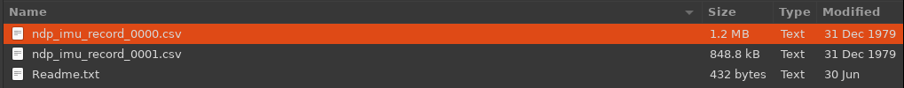
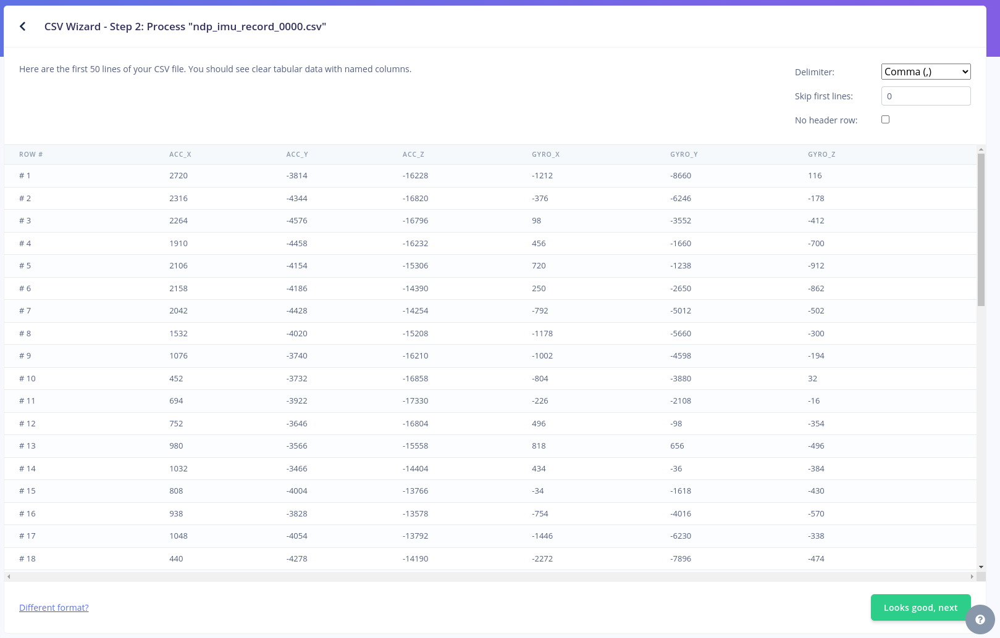
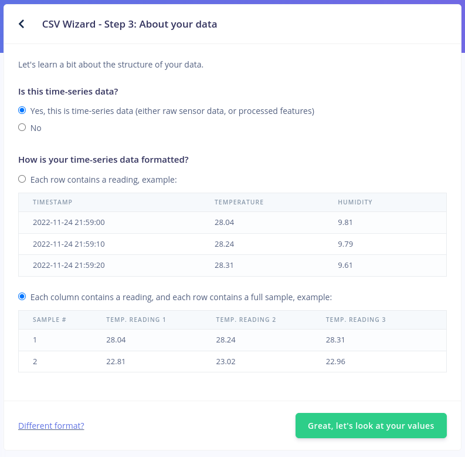
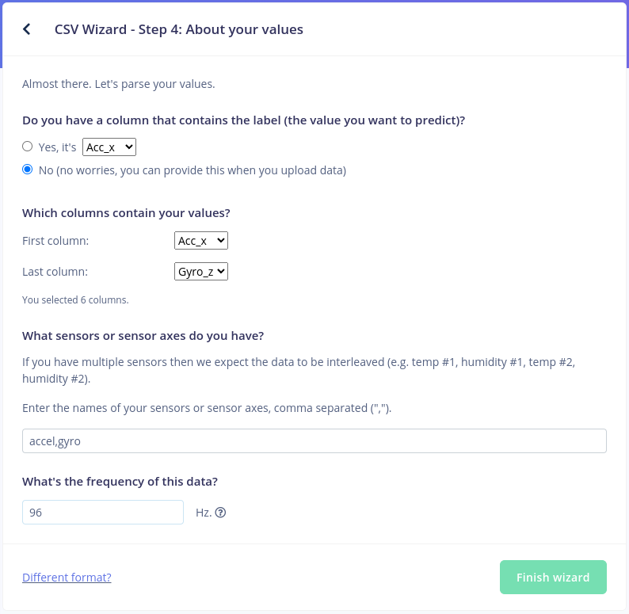

# Using Edge Impulse Uploader

The RASynBoard can be used to collect IMU data to upload to Edge Impulse for training or testing.

## Prerequisites

### Load the RASynBoard OOB Application onto your device
You should have the latest RASynBoard OOB release loaded onto your RASynBoard including the microSD card files associated with the release.

- [Using RASynBoard Releases](./UsingRASynbBoardReleases.md)
    - All the details you need to load the latest OOB tested release onto your board
- [RASynBoard Getting Started Guide](./RASyBoardGettingStarted.md)
    - All the details to clone the OOB repo, build the application and load it onto your RASynBoard

### Install NodeJS with npm
In order to use the data forwarder, you must have NodeJS with npm installed. Please refer to the NodeJS website for installation: https://nodejs.org/en/download/package-manager

Once you have installed NodeJS and npm, install the Edge Impulse CLI tools with the following command:

MacOS/Linux:

```bash
sudo npm install -g edge-impulse-cli
```

Windows:

```Powershell
npm install -g edge-impulse-cli
```

## Setting Up RASynBoard
- Verify you have copied all the microSD card files onto your RASynBoard microSD card's root directory
    - If using the latest release use files in the microSD-Files-v<current version>.zip file
    - If building the project copy all the files in the ndp120/synpkg_files directory onto your microSD card's root directory

Modify the config.ini to contain the following:

**Note** We're . . . 
- Loading the "Circle Motion" model
- Setting the recording period to 30 seconds
- Sending the IMU data output to a file

```
[NDP Firmware]
Mode=3      # select function mode:  1->Function_1;  2->Function_2;  3->Function_3; ...

[Function_1]
Description="5-keywords Single Mic"
MCU=mcu_fw_120.synpkg
DSP=dsp_firmware.synpkg
DNN=menu_demo_512_general_v105_rasyn_pdm0_ext_icm.synpkg
#DECIMATION_INSHIFT_VALUE=10    # http://avnet.me/RASynDocsDecimationInshift

# Reduce the 5-keyword model input audio gain by 6db for better performance
DECIMATION_INSHIFT_OFFSET=-1

[Function_2]
Description="5-keywords Dual Mic"
MCU=mcu_fw_120.synpkg
DSP=dsp_firmware_noaec_ff.synpkg
DNN=menu_demo_512_noaec_ff_v105_rasyn_pdm0_ext_icm.synpkg

[Function_3]
Description="Circle Motion"
MCU=mcu_fw_120.synpkg
DSP=dsp_firmware.synpkg
DNN=circular_motion_NDP120B0_icm42670.synpkg
Button_shift=imu      # redefine the short press user button to capture the IMU data

# http://avnet.me/RASynDocsLeds
[Led]
# set led response color for each voice command, choose from # "red","green","blue","yellow","cyan" and "magenta".
IDX0=yellow     # ok-syntiant
IDX1=cyan       # up
IDX2=magenta    # down
IDX3=red        # back
IDX4=green      # next

# http://avnet.me/RASynDocsDebugPort
[Debug Print]
# Select debug port for application debug:  
#  1->by UART     # On the I/O board PMOD connector
#  2->by USB-VCOM # On the core board USB-C connector
Port=1         

[Recording Period] 
# Defines the duration of voice or IMU data recording 
# when the user button is pressed.
Recording_Period=30    # in seconds

# http://avnet.me/RASynDocsImuDataStream
[IMU data stream]
# Defines where to capture IMU data when the record button is 
# pressed.  Note that the [Function_x] block selected must
# define "Button_shift=imu" for this feature to work.   
#  0->Disable
#  1->Enable
Write_to_file=1        # write data to a *.csv file on the sdcard
Print_to_terminal=0    # output data to the serial debug terminal
    :
    :
    :
```
Remove the microSD card and insert into the RAsynBoard.

Power on the RASynBoard.

## Capturing Data

### Run CSV Wizard

Create a free account with Edge Impulse and create a new project if one isn't already created: https://studio.edgeimpulse.com/studio/profile/projects

Press the user button to start printing IMU data to the serial port:


Navigate back to the projects page and select your project. In the project, select the `Data Acqusition page. Startup the CSV Wizard by clicking CSV Wizard:


Remove the microSD card from the RASynBoard and mount it on your computer. Click select file and select the IMU csv file:


You should be presented with a preview of the uploaded data.

Remove the microSD card from the RASynBoard and mount it on your computer. Click select file and select the IMU csv file:


Click the next button.

You'll be presented with a pane to specify the type of data. Ensure that the time series option is slected and the option stating each column contains a reading and fill row contains a sample:


Click the next button.

On the pane, select no for the first option. For first column, select `Acc_x` and last column select `Gyro_z`.

For the list of sensors, enter:

```
accel,gyro
```

For data frequency, enter 200Hz


Finally, select finish wizard.

# Setup and Run Uploader

Run the following command in a terminal window:

```bash
edge-impulse-uploader --label <LABEL_NAME> --category <training|testing> <PATH TO CSV FILE>
```

Replace `<LABEL_NAME>` with the desired label name. After `--category` specify whether the data is used for trainging or testing. Finally, specify the path of the file you're uploading. 

Example:

```bash
edge-impulse-uploader --label circle --category trainging ./ndp_imu_record_0000.csv
```

At this point, you should be prompted with your Edge Impulse credentials:

```
Edge Impulse uploader v1.20.0
? What is your user name or e-mail address (edgeimpulse.com)? evan.stoddard@avnet.com
? What is your password? [hidden]
```

If you have more than one project, the following menu will be presented:

```
Upload configuration:
    Label:       circle
    Category:    training

? To which project do you want to upload the data? 
  Evan Stoddard / RASynBoard-Forwarder 
❯ Evan Stoddard / RASynBoard-Uploader 
```

Select the desired project. If there's only one project on your account, it will automatically be selected.

At this point the file should be uploaded:

```
[1/1] Uploading /ndp_imu_record_0000.csv OK (1626 ms)

Done. Files uploaded successful: 1. Files that failed to upload: 0.
```

The data should appear on the edge impulse data aqcuisition page:

More information on the data uploader can be found at the following link: https://docs.edgeimpulse.com/docs/edge-impulse-cli/cli-uploader