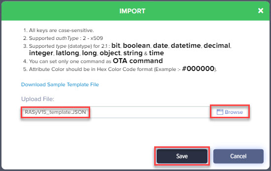
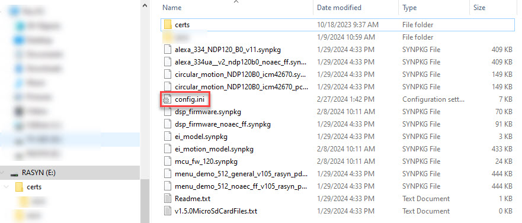
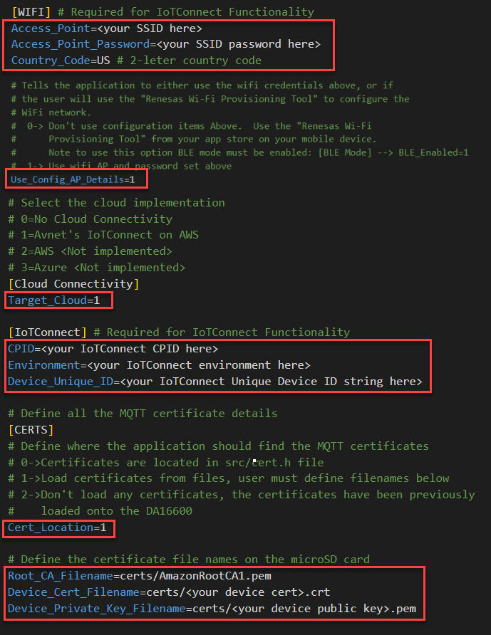
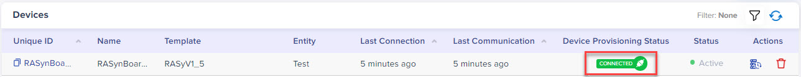

# IoTConnect Instructions

This document includes all the details required to . . . 

1. Request a free IoTConnect on AWS trial account
1. Create a new IoT device in IoTConnect on AWS
1. Configure the Avnet Out-of-Box (OOB) application to connect to the new device on IoTConnect
1. Run the demo and verify that inference data is sent to IoTConnect

# Prerequisites

1. You have an [Avnet RASynBoard EVK](http://avnet.me/rasynboard)
1. You have a microSD card for the EVK
1. You have a USB-C cable to connect the EVK to your development PC
1. You have completed the [RASynBoard Getting Started Guide](./RASyBoardGettingStarted.md)
1. You have exercised the **5-keyword ML model "up", "down", "back", "next", "ok-syntiant"**
1. You have a [USB to TTL debug cable](https://www.adafruit.com/product/954) to view debug from the OOB application

# Request a Free IoTConnect Trial Account

Until recently the Avnet IoTConnect platform was implemented only in the Azure cloud.  However, in Feb 2023 the IoTConnect team has [released the platform on AWS](https://news.avnet.com/press-releases/press-release-details/2023/Avnet-Announces-the-Release-of-its-First-Product-based-on-Global-Strategic-Collaboration-Agreement-with-AWS/default.aspx).  This example only runs on the AWS implementation.

The IoTConnect team is currently working on a IoTConnect on AWS self-sign-up portal for new customers to request a free trial account.  The self-signup page is scheduled to release in Jan 2024.  Until then, please request a trial account by contacting the IoTConnect sales team.

1. Navigate to the IoTConnect [Contact us](https://www.avnet.com/wps/portal/us/solutions/iot/contact-us/) web page
1. Fill out the form with your contact information
1. In the "Please describe your request:" text box paste in the text ```"I would like to request a free trial IoTConnect account to explore the Avnet RASynBoard Out-of-Box demo on IoTConnect AWS."```

Once you have an account on IoTConnect come back to this document to move forward . . .

# Create a New Device on IoTConnect

1. Open the IoTConnect website.  The URL will depend on your account, your welcome email will have the URL to open IoTConnect.

Here are the high level tasks we need to complete in IoTConnect . . . 

1. Create a device template
1. Create a new IoT device
1. Download the certificates for your device

## Create a Device Template

The first thing we need to do is create a device template, since the template is a required input when we create a new IoTDevice.  A device template is a self-contained file that defines a set of resources, configuration, and rules for devices on IoTConnect.  We're going to create a very simple template for the OOB application.

1. Open the **devices** page


2. Select the **Templates tab** from the bottom of the page


A note about the items we'll add to the device template. We're going to add template **attributes**, these are the telemetry items that the application will send to IoTConnect each time the NDP120 detects an inference event, i.e., "Up."  When we define attributes we're defining ```{"key": value}``` JSON pairs.  The application must use the exact same key when sending telemetry data.  The ```keys``` we'll define match the Avnet OOB application implementation.  If you change or add additional telemetry items, just make sure the application matches your IoTConnect template attributes.  

Note that we're just creating 3 ```{"key": value}``` pairs.  **msgCount, inferenceIdx and inferenceStr**.

Here's the line of code that constructs the telemetry JSON:  

``` 
    // Create the JSON
    snprintf(telemetryMsg, sizeof(telemetryMsg), "{\"msgCount\": %d, \"inferenceIdx\": %d, \"inferenceStr\": \"%s\"}", msgCnt++, inferenceIndex, inferenceString);
```

Here's the debug you'll see when the "Up" keyword is detected:

```
NDP MATCH!!! -- [0:1]:NN0:up without sec-val

{"msgCount": 0, "inferenceIdx": 1, "inferenceStr": "NN0:up"}
```

You can either import an existing template, or create one from scratch.  I've included both methods.

## Import an Existing Template (Method #1)

Importing a template is a quick way to use a template that someone else has already created.  Templates can be large, and manually inputting all the details can be tedious.  I've included [a template](./assets/IoTConnect/RASyOobV1.5_template.JSON) that works with the OOB application in this GitHub repo.  You can also manaully edit an existing template, it's just a JSON document.  However, editing templates is beyond the scope of this document.

1. Click on the **Import** button in the upper right hand corner


2. The **Import** dialog opens
    1. Use the **Browse** link to find the ```/docs/assets/IoTConnect/RASyOobV1.5_template.JSON``` file
    1. Click the **Save** button



## Create a Template from Scratch (Method #2)

**Note:** If you imported the template using method #1, you can skip down to the next section **Create a New Device** 

1. Select the **Create Template** button in the upper right hand corner


2. The **Create Template** form opens
    1. Give your template a code (must be 10 characters of less)
    1. Give your template a name
    1. Select **Self Signed Certificate** for authentication type (IoTConnect will generate certificates for our device)
    1. Select **2.1** for the Device Message Version
    1. Select the **Save** button


3. Now we can update the template and tell it about the telemetry items we'll send from the OOB application.  
    1. Select the **Attributes** tab, add the following details, then click save. 
 
    

    2. Add the two more attributes using the details shown below 

    

    

    3. Once you've added all three items, you're template will display all the attributes you added.  It should look like the graphic below

    

## Create a New Device

1. Open the **devices** page


2. Select the **Devices tab** from the bottom of the page


3. Select the **Create Device** button in the upper right hand corner


4. The **Create Device** form opens.  Fill it out and click the **Save** button
    1. For the Entity field, you likely only have one option and it will be different than mine; select the only option shown in your interface.


5. Your device will be shown in the devices list


## Download the certificates for your new Device

When we created the new device with **Self-Signed Certificates** IoTConnect generated the device certificate and the device public key certificate.

1. Open the device by clicking on the Unique ID link, in my case **RASynBoardDemo**.  
2. Click on the **Connection Info** link 


3. The **Connection Info** pop-up opens, showing all the nitty gritty details for your device on AWS.  
4. Click on the certificate download link


5. Your certificates are downloaded to your **Downloads** folder
6. Close the **Connection Info** pop-up window


# Checkpoint

So far we have . . . 

- Requested a free IoTConnec on AWS account
- Received the free account access
- Created a new device template describing the telemetry items that the OOB application sends
- Created a new device using the template
- Downloaded the device's certificates

# Update the Avnet Out-of-Box application with details for our new device

At this point it's important that all the prerequisites detailed at the top of this document have been completed.  Please review them and make sure you're ready to proceed.

## Collect required details from IoTConnect on AWS

There are three IoTConnect details we need to configure the OOB application to connect to our new device.  We'll add them to the config.ini file on the RASynBoard microSD card.  I recommend opening up a text document to capture these items.   

### Company ID (CPID) and Environment (env)

The company ID and the Environment are both displayed on the **Key Vault** page.  Note you can copy them by selecting the copy link to the left of the text


### Device Unique ID 

The Unique ID can be found on the Devices page


Find your device and copy the Unique ID by using the copy link to the left of your device's Unique ID


# Configure the Avnet Out-of-Box application

We're getting close now!  The next step is to configure the OOB application by adding the device certificates and updating the config.ini file that's located on the microSD card.  Since you already completed the [RASynBoard Getting Started Guide](./RASyBoardGettingStarted.md) you updated your microSD card with all the files from the /ndp120/synpkg_files/* folder.  

## Copy the Device Certificates to the microSD card

1. Extract the two certificates from the zip file you downloaded from IoTConnect
1. Copy them to the microSD card into the /certs directory
1. The certs directory should already contain the AmazonRootCA1.pem file, if not copy it from the repo /ndp120/synkpg_files/certs folder


## Update the Config.ini file

1. Open the config.ini file by either removing the microSD card from the RASynBoard and using a microSD card reader, or by running the OOB application and connecting your USB-C cable to the USB-C connector on the core board.

If you use the RASynBoard OOB application . . . 

1. Make sure the OOB application is loaded onto the device (if you completed the [RASynBoard Getting Started Guide](./RASyBoardGettingStarted.md) this is done)
1. Make sure that the Jumper is installed on J3 across pins 1-2 (this will auto boot the application)
1. Connect your development PC to the USB-C connector on the core board (NOT the I/O board)


Once the application boots, the microSD card will enumerate on your development PC as an external USB drive



1. Update the following items in your config.ini



My updated file looks like this . . .


# Run the demo

Now that everything is configured, we can run the demo!  Cycle power on the device by disconnecting/reconnecting the USB-C connector from your development PC.

1. **Note**: When the application starts up it outputs the configuration so you can confirm that your settings are being used . . .


2. **Note**: The debug will show the different states that the IoTConnect thread processes while connecting to IoTConnect.  If your device does not connect watch the debug for **ERROR** debug messages.


The OOB application implements a queue for telemetry data.  This way if telemetry data is generated before the application is connected to IoTConnect, the message is not lost.  As soon as the MQTT connection is established the IoTConnect thread looks for messages in the queue and if present they get sent to IoTConnect!  Additionally, the application verifies that there is a valid MQTT connection before sending any telemetry.  If not, the state machine is rolled back to re-establish the MQTT connection.

3. Let's go back to IoTConnect and verify that the device is on-line
4. Open the **Devices page** and verify that your device is on-line



5. Now open your device by clicking on the **Unique ID** link
6. Click on the **Live Data** link at the left
7. If not automatically selected, select the **Telemetry** tab 


8. Now speak one of the keywords "Up"
    1. Note the debug shows the telemetry that's being sent
    1. Note that in IoTConnect the telemetry shows up in the Live Data --> Telemetry tab!


# Conclusion

I hope you were successfull in sending telemetry data to IoTConnect on AWS.  If you encounter any issues or have questions feel free to [open an issue in the repo](https://github.com/Avnet/RASynBoard-Out-of-Box-Demo/issues)


