# Avnet Out-of-Box Development Notes

This document captures some common development activities around modifying the Avnet RASynBoard Out-of-Box (OOB) application.  The OOB application is a good starting point to develop custom ML at the Edge applications for your ML based solutions. 

This document and images were written based on the V1.4.0 release.  However, all the concepts will remain relavant as the OOB application is further improved.  If the line numbers in the current release are different than my images, just search the file to find the new locations.

I've tried to capture some common application tasks.  If I missed your specific case, please open a [GitHub issue](https://github.com/Avnet/RASynBoard-Out-of-Box-Demo/issues) and I'll see what can be done to help.

# Inferencing Events

One of the main features of the RASynBoard hardware and the OOB application is to capture ML inference events and process the events.  This section identifies the code that runs when an inference event is encountered.

1. NDP120 detects an inference event
    1. ```ndp_thread_entry.c::ndp_thread_entry()``` receives an event and the inference ID ```ndp_class_idx``` is used to pass control to the ```case``` statement responsible for processing the specific event.  

The OOB implementation in this area is not very efficient, but it does make it easy to add code specific to the inference index.

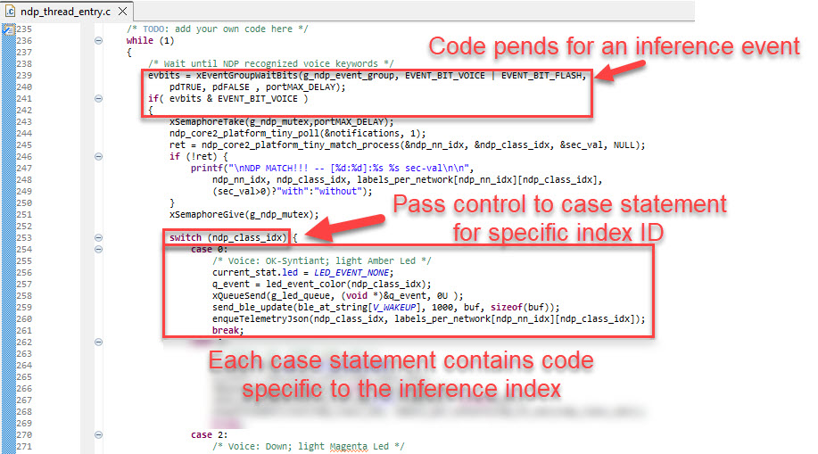


# Modifying telemetry messages

The OOB application will send JSON telemetry up to the configured cloud every time an inference event is detected.  This section of the document . . . 
1. Explains what telemetry is
1. Points the developer to the code where the telemetry messages are created
1. Explains how the OOB application sends telemetry messages to the cloud
1. Documents how to modify the application to send your own custom telemetry message to the cloud 

Sending custom telemetry is a lot easier than you might think!

If you just want to know how to add your own telemetry skip down to the [So you want to create a custom telemetry message?](./OobDevelopmentNotes.md#so-you-want-to-create-a-custom-telemetry-message) section.  Otherwise, continue to learn how it all works in the OOB application.

## What is a telemetry message?

Telemetry messages are valid JSON documents that represents whatever data the developer wants to send to the cloud.  This could be a simple ```{"key": value}``` pair, or a complex JSON document that includes JSON objects, JSON lists or any valid JSON.  Typically, you don't need to pre-define the JSON on the cloud side, you can just send it up.  However, if you're going to do anything with your data once it's in the cloud, you must configure the cloud, or implement an application to know about your data.

- AWS provides the [AWS IoT MQTT client](https://docs.aws.amazon.com/iot/latest/developerguide/view-mqtt-messages.html) to help you see the data ingested by the cloud.  See the [AWS IoT Core](./awsIoTCore.md) documentation to learn how to connect your device to AWS IoT Core and view incomming MQTT data.

- IoTConnect provides a **Live Data** tab that will display incomming MQTT messages, however if you want to create a dynamic dashboard with the data, you'll need to create a device template that describes the data.  See the [IoTConnect](./IoTConnect.md) documentation to learn how to connect your device to IoTConnect and create a device template.

### Validate your JSON

There will come a time when your application generates some JSON and things are not working correctly on the cloud side.  When this happens, you should make sure the application is sending valid JSON.  My favorite tool to validate JSON is called [JSONLint](https://jsonlint.com/?code=).  This web page allows you to paste in your JSON text, hit the **Validate JSON** button and see the results.  If there is an error, there will be text showing where the error was found.

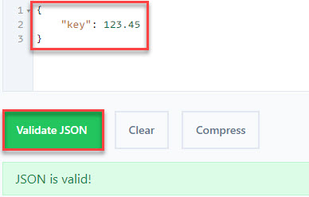

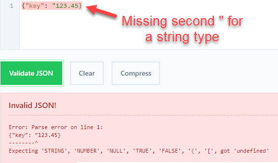

## Where does the OOB application generate a telemetry message?

The OOB application generates telemetry every time the NDP120 detects an inference event.  The basic sequence of events is . . . 

1. NDP120 detects an inference event
    1. ```ndp_thread_entry.c::ndp_thread_entry()``` receives an event and the inference ID ```ndp_class_idx``` is used to pass control to the ```case``` statement responsible for processing the specific event.  
    1. The data to send as telemetry is passed to ```enqueTelemetryJson()```

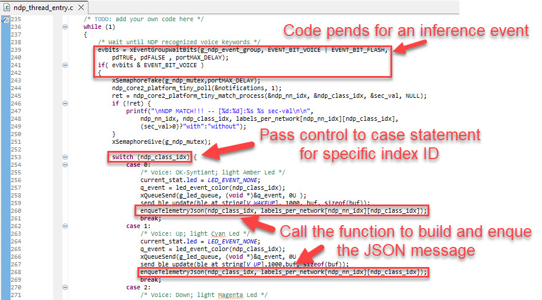

2. We generate the JSON string using ```snprintf()```.  Just like using ```printf()``` we can use different format specifiers and variables to populate the specifiers to construct the JSON string.  

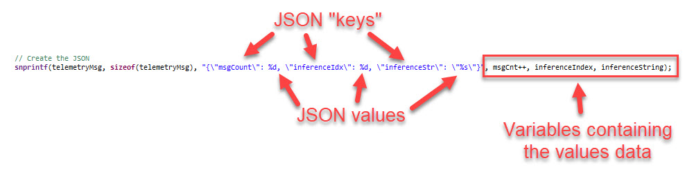

**Note** that the quotes embedded in the JSON string are escaped i.e., ```\"```

## Telemetry Queue

The application implements a queue called ```g_telemetry_q``` to capture telemetry data.  The telemetry data is pulled from the queue only if the application is connected to the cloud solution.  This allows the application to generate telemetry data before the application is connected to the cloud and send the telemetry once the cloud connection is established.

The ```enqueTelemetryJson()``` function . . . 

1. Allocates heap memory for the JSON string
1. Copies the JSON string into the heap memory
1. Enqueues the heap pointer, not the actual JSON string

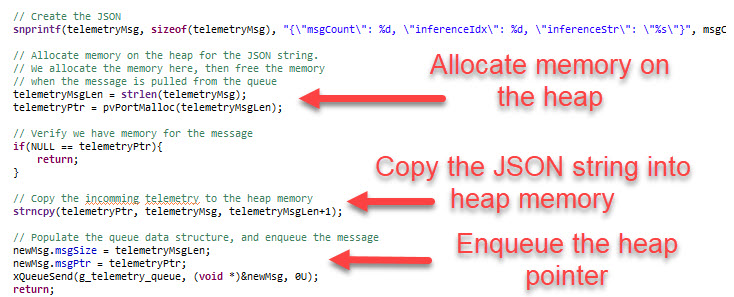

So now we have generated the JSON message, and saved a pointer to the message in the ```g_telemetry_q```

## Dequeue the Telemetry Pointer and send it to the cloud

The OOB AWS and IoTConnect on AWS implementations setup a MQTT connection for telemetry data.  The ```iotc_thread_entry.c``` file implements a simple state machine to establish and maintain the MQTT connection and once the connection is established, the thread pends on the ```g_telemetry_q``` queue waiting for data to send.

The ```wait_for_telemetry()``` function . . .

1. Pends on the queue waiting for a message
1. Verifies that there is a MQTT connection
1. Using ```snprintf()``` uses the JSON telemetry and prepends the DA16600 send MQTT AT command
1. Sends the AT command along with the JSON to the DA16600 to send out
1. Frees the heap memory

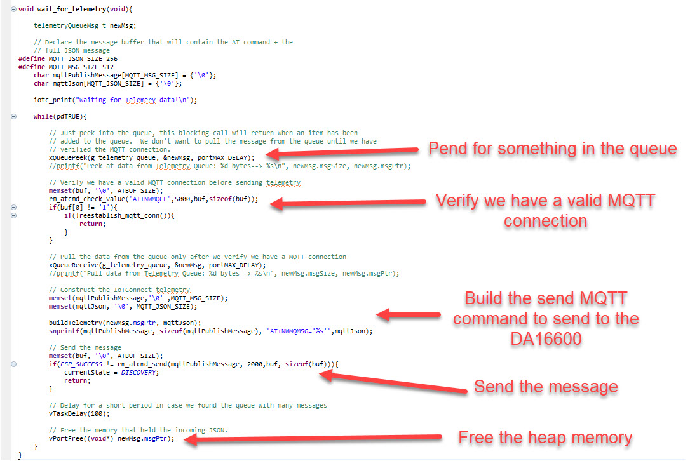

## So you want to create a custom telemetry message?
Now that you understand how inference data is sent to the cloud you can modify the application to send any JSON data you like.  My recommended steps would be to . . . 

1. Copy the enqueTelemetryJson() function
    1. Rename it
    1. Add arguments for the data you want to send
    1. Modify the ``` snprintf(telemetryMsg, sizeof(telemetryMsg), "{\"msgCount\": %d, \"inferenceIdx\": %d, \"inferenceStr\": \"%s\"}", msgCnt++, inferenceIndex, inferenceString);``` statement to construct the JSON you want to send

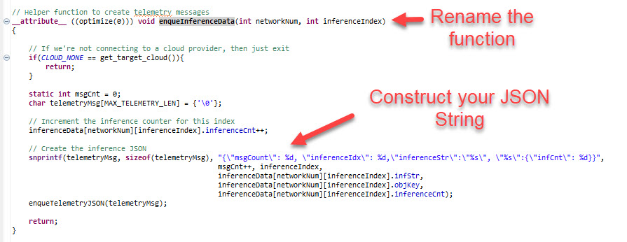

That should do it!  Now you can send your data to the cloud!

# Application Configuration Items

The OOB application leverages a config.ini text file located in the root directory of the microSD card for runtime configuration items.  By defining runtime configuration items, we don't need to rebuild the application to enable/disable any OOB features.  This section details how to add new configuration items to the config.ini file and where to add code in the application.

For this example, I'll be adding two new configuration items . . .
1. [AWS]->Endpoint
1. [AWS]->Device_Unique_ID

## Define the new items and add them to the config.ini file

**Note** I edited the config.ini file on the microSD card and added a new section called ```AWS``` and two new keys items under the ```AWS``` section.

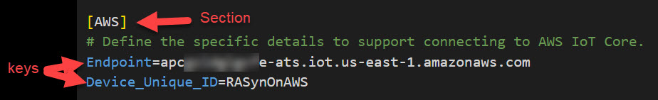

## Decide if the new items need to be accessible when booting from SPI Flash

There are two basic RASynBoard hardware configurations to consider . . .  

- Boot from microSD Card
  - Configuration items are read from the config.ini file
  - Core board attached to I/O board and microSD card inserted into I/O board
- Boot from SPI Flash
  - Configuration items are read from SPI Flash
    - config.ini contents were writing to SPI flash by pressing the user button > 3 seconds
    - MicroSD card removed
    - Core board removed from the I/O board

In most cases you'll want to have your new configuration item in SPI Flash.  That way when you deploy your solution on the core board only, your configuration items will be available.  But in some cases you may not need the configuration items in Flash.  For example the ```aws_rootCA_file_name``` string is only used when the certificate configuration is set to read the certificates from the microSD card.

In the cases where you don't need your configuration items in SPI Flash, define your new configuration variables in ```src\fat_loat.c``` in the local global variable area; then continue to follow the instruction below but reference your variables instead of the configuration structure.

**The rest of this section assumes that you'll need to access your new configuration from SPI flash down the road.**

## Add code to parse the new Keys
Now that we've defined what the new configuration items are we can add the code to parse the new items and add helper functions to retrieve the key values from anywhere in the application.

We need to complete the following steps . . .
1. Add new variables for the keys
1. Add code to ```src\fat_load.c::read_config_file( void )``` to parse the data from the config.ini file and update our new variables
1. Add helper functions to ```get``` the new configuration items
1. Add code to output the new configuration items at startup 
1. Verify the functionality

### Add new variables for the keys
- Open ```src\fat_load.h```
- Locate the ```config_ini_items``` struct and add your new configuration items.
  - If you're new item is an enumeration, add the enum definition to ```src\fat_load.h```
  - See ```AWS_CERT_LOAD_FROM_TYPE``` for an example of an enumeration configuration item

**Note** that since we added our new variables to the ```config_ini_items``` struct our new items will automatically be written to SPI Flash and read from SPI Flash using existing logic.

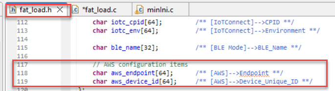

### Add code to ```read_config_file(void)``` to parse the data from the config.ini file

- Open ```src\fat_load.c```
- Find the function ```src\fat_load.c::read_config_file(void)```

If we review the different ways to read configuration items in this function we'll see that there are two different function calls to get data from the config.ini file depending on the data type.

```c++,
int ini_gets(const TCHAR *Section, const TCHAR *Key, const TCHAR *DefValue,
             TCHAR *Buffer, int BufferSize, const TCHAR *Filename)
```
 
  - This is the function we use to pull string data from the config.ini file
  - Copy an existing call and change the ```Section```, ```Key```, ```DefValue```, ```Buffer```, and ```BufferSize``` arguments to target your new items
    - ```Section```: The new section; in our example **AWS**
    - ```Key```: One of the new keys; in our example **Endpoint**  
    - ```DefValue```: A default value for the item for the case where the item is not found in the config.ini file
    - ```Buffer```: The string variable name
    - ```BufferSize```: The max number of characters that the function will pull into your ```char*``` variable

```c++,
long ini_getl(const TCHAR *Section, const TCHAR *Key, long DefValue, const TCHAR *Filename)
```
  - This is the function we can use to pull numerical data
  - Note that the function returns a type ```long``` value

I added the following lines to read the new AWS configuration items

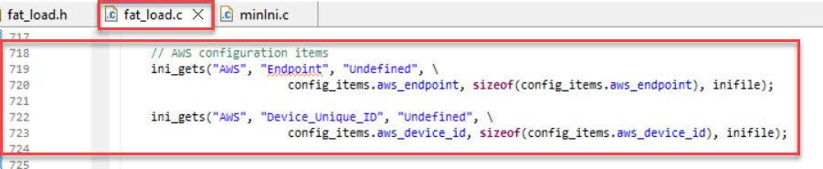

### Add helper functions to ```get``` the configuration items

We'll want to access our configuration items from other files in the project, so let's add a couple helper functions.

- Add the function prototypes to ```src\fat_load.h```

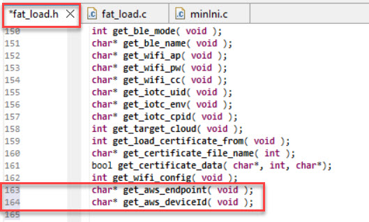

- Add the function definitions to ```src\fat_load.c```

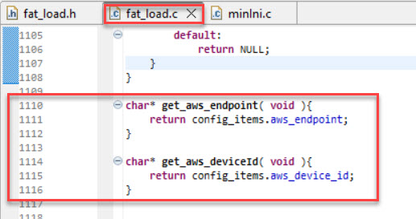

### Add code to output the new configuration items at startup

I like to output the configuration items on startup to show the user the current configuration.  We can also use this code to validate that our new configuration items are being correctly parsed from the config.ini file.

- Find the ```src\fat_load.c::printConfig(void)``` function
- Add code to output the new configuration items

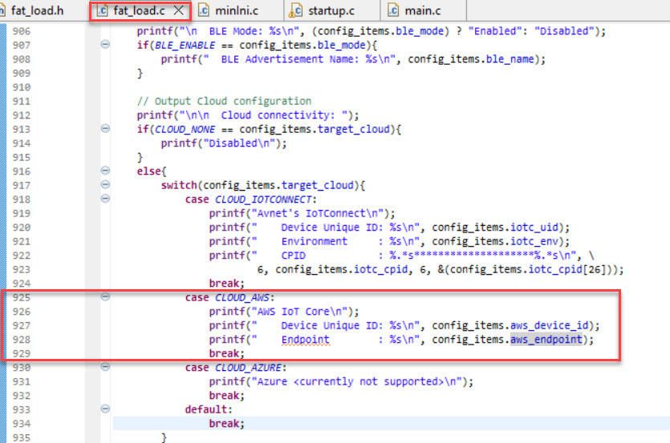

### Verify the functionality

- Build and run the updated application
- Verify that the output matches the strings added to the config.ini file 


# Areas for improvement

## Low Power 

We still need to dig deeper into the DA16600 low power modes.  The current implementation holds the DA16600 in reset unless there is an active cloud feature enabled or if BLE is enabled.

## Add enqueue timestamps when sending telemetry

The current telemetry implementation does not capture a timestamp when the telemetry message was created.  This is usually not an issue, but if telemetry messages are not sent because of a network issue, then we really don't know when the data was captured.

The IoTConnect implementation adds timestamps after the telemetry message is pulled from the g_telemetry_queue, but the timestamp does not identify when the data was generated.
