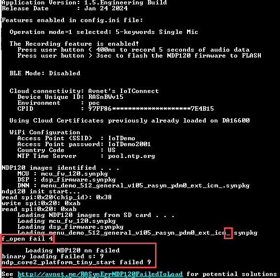
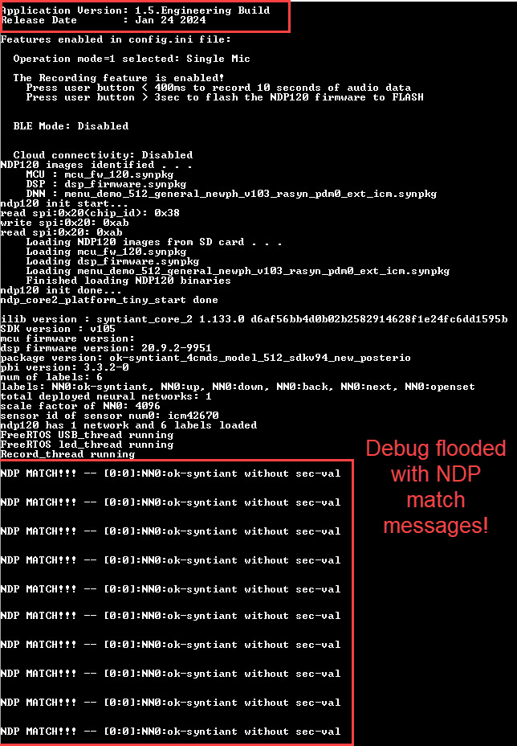

# RASynBoard Out-of-Box Troubleshooting Guide
This document captures common errors that may be encountered while using/modifying the Avnet RASynBaord Out-of-Box (OOB) application

# NDP Failed to Load Models
## ```ndp_core2_platform_tiny_start failed 9```

### How to identify this issue
- The ML model does not load 
- You see debug similar to



### How to resolve the issue
This error occurred because the *.synpkg filenames defined in the selected config.ini [Function_x] block are not found in the root directory of the microSD card.

- Use the debug output to verify that the filenames defined in the selected config.ini [Function_x] block are spelled correctly
- Verify that the files specified in the  selected config.ini [Function_x] block exist on the microSD card in the root directory

## Application flooded by inference events even though there should be none
### How to identify this issue
- The RGB LED lights and does not turn off
- The debug terminal is flooded with "NDP MATCH!!" messages

The following debug was a result of loading V1.4.0 models while running the V1.5.0 Out-of-Box application



## Syntiant SDK version mismatch
The OOB application is built using a specific Syntiant SDK version.  Any ML models loaded to the NDP120 must have been generated using the same Syntiant SDK version.  

### SDK Versions by OOB Release
| OOB Application Version | Syntiant SDK Version |
| ----------------------- | -------------------- |
| v1.1.0 | v100 |
| v1.2.0 | v100 |
| v1.3.0 | v100 |
| v1.4.0 | v103 |
| v1.5.0 | v105 |

### History of Edge Impulse Generated Models
| Release Date | Syntiant SDK Version used to generate ML models | Compatible Out-of-Box Release |
| ------------ | ----------------------------------------------- | ----------------------------- |
| Oct 2022 | v103 | V1.4.0 |
| Feb x 2023 | v105 | V1.5.0 |

### How to resolve the issue

1. If using the pre-built ML models that come with the OOB application verify that you're using the microSD card files that correspond with the OOB application version.  Each release is delivered with compatible ML models and the matching config.ini file.  If you're building the application from source, verify that your microSD card contains the files from the ndp120/synpkg_files/ directory.

1. If using models generated by Edge Impulse, refer to the [table above](#history-of-edge-impulse-generated-models) to identify a compatible Out-of-Box release that supports the models generated by Edge Impulse.