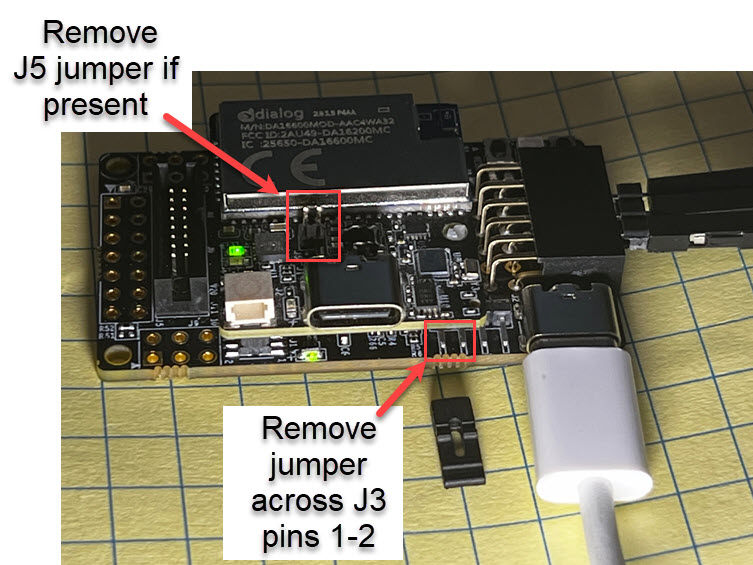

# RASynBoard Out-of-Box Troubleshooting Guide
This document captures common errors that may be encountered while using/modifying the Avnet RASynBaord Out-of-Box (OOB) application

# Table of Contents

- Application Issues
    - [OOB Application hangs, user button not working](#application-hangs-buttons-not-working)
- NDP120 Issues
    - [NDP120 failed to load model: ```ndp_core2_platform_tiny_start failed 9```](#ndp_core2_platform_tiny_start-failed-9)
    - [Continuous NDP120 MATCH!!! events](#application-flooded-by-inference-events-even-though-there-should-be-none)
- Debug Issues
    - [No debug from PMOD UART](#no-debug-from-pmod-uart-even-though-the-appplication-is-configured-to-do-so)
    - [No startup debug from the Virtual COM port on the core board](#when-using-the-virtual-com-port-associated-with-the-usb-c-connector-on-the-core-board-i-dont-see-startup-debug) 
- Development Issues
    - [Debugger fails to launch ```The device R7FA2A1AB . . . configuration does not match```](#debugger-fails-to-load-the-device-r7fa2a1ab-set-in-the-launch-configuration-does-not-match)
    - [Debugger connection failed](#debug-connection-failed)
- Renesas Flash Programmer Errors
    - [Error(E3000107): This device does not match the connection parameters](#rfp-errore3000107-this-device-does-not-match-the-connection-parameters)

# Application Issues
## Application hangs, buttons not working
This error has been identified to be an issue between the OOB FSP microSD card driver and a microSD card that may have errors

### How to identify this issue
- The OOB application stops running, or does not perform some features 
- The user button (button closest to the corner of the board) does not respond when pressed
- The issue is not reproducible when powering the board from the USB-C connector on the I/O board (the larger bottom board)
- Is only reproducible when powering the EVK using the USB-C connector on the core board (the smaller board)

### How to resolve the issue
To resolve the issue, fix any errors with the microSD card's file system by reformatting the card

1. Copy all the files from the microSD card to a temporary folder on your development PC
1. Format the drive as a FAT32 device
1. Move the saved files back onto the microSD card
1. Insert the microSD card back into the RASynBoard's I/O board
1. Verify that the issue is not reproducible

# NDP Failed to Load Models
## ```ndp_core2_platform_tiny_start failed 9```

### How to identify this issue
- The ML model does not load 
- You see debug similar to


### How to resolve the issue
This error occurred because the *.synpkg filenames defined in the selected config.ini [Function_x] block are not found in the root directory of the microSD card.

- Use the debug output to verify that the filenames defined in the selected config.ini [Function_x] block are spelled correctly
- Verify that the files specified in the  selected config.ini [Function_x] block exist on the microSD card in the root directory

## Application flooded by inference events even though there should be none
### How to identify this issue
- The RGB LED lights and does not turn off
- The debug terminal is flooded with "NDP MATCH!!" messages

The following debug was a result of loading V1.4.0 models while running the V1.5.0 Out-of-Box application


## Syntiant SDK version mismatch
The OOB application is built using a specific Syntiant SDK version.  Any ML models loaded to the NDP120 must have been generated using the same Syntiant SDK version.  

### SDK Versions by OOB Release
| OOB Application Version | Syntiant SDK Version |
| ----------------------- | -------------------- |
| v1.1.0 | v100 |
| v1.2.0 | v100 |
| v1.3.0 | v100 |
| v1.4.0 | v103 |
| v1.5.0 | v105 |

### History of Edge Impulse Generated Models
| Release Date | Syntiant SDK Version used to generate ML models | Compatible Out-of-Box Release |
| ------------ | ----------------------------------------------- | ----------------------------- |
| Oct 2022 | v103 | V1.4.0 |
| Feb x 2023 | v105 | V1.5.0 |

### How to resolve the issue

1. If using the pre-built ML models that come with the OOB application verify that you're using the microSD card files that correspond with the OOB application version.  Each release is delivered with compatible ML models and the matching config.ini file.  
1. If you're building the application from source, verify that your microSD card contains the files from the ndp120/synpkg_files/ directory.
1. If using models generated by Edge Impulse, refer to the [table above](#history-of-edge-impulse-generated-models) to identify a compatible Out-of-Box release that supports the models generated by Edge Impulse.

# Debug Issues
## No debug from PMOD UART even though the application is configured to do so

### How to identify this issue
If the application is configured to send debug output to the PMOD UART ```config.ini:[Debug Print]-->Port=1``` but you never see any debug from that UART, or maybe you only see one print statement ```FreeRTOS ndp_thread running```

### How to resolve the issue
- Verify that the config.ini file is correctly configured


- Verify that the microSD card is inserted into the RASynBoard I/O board
- Verify that the microSD card contains the config.ini file

When the microSD card is not inserted or if the config.ini file is not found on the microSD card, the application defaults to sending debug out the Virtual COM port associated with the USB-C connector on the core board

- Check to see if the debug is being output to the Virtual COM port associated with the USB-C connector on the core board
    - Initiate a NDP match to see debug

- [Video Link "Understanding Debug" (5 minutes)](http://avnet.me/RASynUnderstandingDebugVideo)
- [Debug documentation Link](./ApplicationUserGuide.md/#debug-print)

## When using the Virtual COM port associated with the USB-C connector on the core board I don't see startup debug

This is an implementation artifact.  Since this COM port is implemented in software, the application must bring the hardware interface up at boot time.  This action takes longer than the initial NDP120 load/boot time.

### How to resolve this issue

There is an undocumented feature where the user can enter ```log``` in the terminal to dump the early debug after the fact.  There's lots of room for improvement on this feature; however it works.

# Development Issues

This section captures issues you may encounter when developing custom applications for the RASynBaord.  The content here is specific to the Avnet RASynBoard OOB application, but should apply to other projects developed in the Renesas e^2 studio

## Debugger fails to load ```The device R7FA2A1AB set in the launch configuration does not match . . .``` "

### How to identify this issue

When trying to debug the application (clicking on the small green bug icon in e^2 studio) the following dialog is displayed . . . 


### How to resolve this issue

- Verify the debugger configuration
    - [Documentation Link - Setting up the debugger](./RASyBoardGettingStarted.md#debug-the-project)
    - [Video Link (7 min)](http://avnet.me/RASynDebuggerIssuesVideo)
        - Video showing this error and how to resolve it

## Debug connection failed

This error will occur if the Renesas e^2 debugger is not found on the development system

### How to identify this issue

When trying to debug the application (clicking on the small green bug icon in e^2 studio) the following dialog is displayed . . . 


### How to resolve this issue

- Verify that the RASynBoard is correctly configured to enable the debugger
- Make sure to use the USB-C connector on the I/O board



If you still can't connect to the debugger, verify that the driver is correctly installed on your development PC

- Verify the hardware configuration as above
- Open your device manager and look for the Renesas USB Development Tools --> Renesas E2 Lite device
- If not found . . .
    - Try to reboot your PC
    - Try reinstalling the Renesas e^2 Studio application


# Renesas Flash Programming (RFP) Errors

## RFP ```Error(E3000107): This device does not match the connection parameters```

### How to identify this issue
When trying to flash a new image (*.srec) to the RASynBoard, the user sees the error below.

<p align="left">
    <br />
    
<br />

### How to resolve this issue

This is a known FSP issue.  To resolve the issue start a new FSP project

1. Launch the **Renesas Flash Programmer** (version 3.11.02 or later)
2. Select **File -> New Project**, the "Create New Project" dialog opens
3. Use the configuration shown, click on the **Connect** button

<p align="left">
    <br />
    
<br />

4. You should see that the application connected to your RASynBoard

<p align="left">
    <br />
    
<br />

5. Flash the board
    1. Select the **Operation Tab**
    1. Browse to and select the *.srec file to load to the board
    1. Click on the **Start** button
    1. The image is flashed to the board, and you should see the application update as shown below

<p align="left">
    <br />
    
<br />

