# Introduction

This document captures the detailed instruction for re-flashing the DA16600 with a new image.  I'll be flashing the AWS image, but the instructions will be similar for other images.

The RASynBoard uses the [DA16600 Wi-Fi/BLE wireless device](https://www.renesas.com/us/en/products/wireless-connectivity/wi-fi/low-power-wi-fi/da16600mod-ultra-low-power-wi-fi-bluetooth-low-energy-combo-modules-battery-powered-iot-devices).  The DA16600 is a highly integrated ultra-low power Wi-Fi system on a chip (SoC) that allows users to develop a complete Wi-Fi solution on a single chip. One nice feature of the DA16600 is that Renesas provides multiple [firmware images](https://www.renesas.com/us/en/products/wireless-connectivity/wi-fi/low-power-wi-fi/da16200-ultra-low-power-wi-fi-soc-battery-powered-iot-devices) to target different applications including images for Azure and AWS!

**Note**: To restore the DA16600 back to the image compatable with this repo, use the ttl scrips and image files located in the /docs/assets/da16600Images folder in this repo.

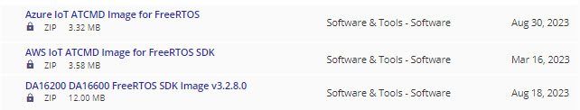

# Prerequisites

1. RASynBoard EVK Rev3 hardware
    - Only the Rev3 EVK hardware pins out the DA16600 signals required to access the DA16600 Debug UART
    - Look at the bottom of the EVK board to verify which revision you have

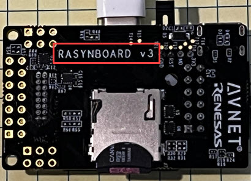

2. High quality USB to TTL device

    - The flashing process connects to the DA16600 Debug UART at a baud rate of 230400 and sends the image using the Y-Modem transfer protocol.  We've observed that inexpensive USB to TTL devices can not perform at this high baud rate without encountering transfer errors.
    - If you see transfer errors when you flash your DA16600, try a higher quality USB to TTL device.  I used [this one]((https://www.adafruit.com/product/954)) without any issues.

3. Application loaded onto the RA6M4 that does not drive any of the shared pins

    - The DA16600 shares two pin connections with the RA6M4
        - **P301 (SCI2_RXD)** and **P302 (SCI2_TXD)**
    - The RA6M4 application should not be driving these pins
    - Note the Avnet RASynBoard OOB application **does not** drive these pins and can be used for the DA16600 re-flashing process

5. Tera Term Installed
    - We'll use a Tera Term script to transfer a DA16600 image
    - If you don't have Tera Term installed you can download the free application from [here](https://osdn.net/dl/ttssh2/teraterm-4.106.exe)

# Load the Avnet RASynBoard Out-of-Box Application

Load the Avnet RASynbBoard Out-of-Box application

- **Note**: The OOB application is only used to make sure that the shared pins are not being used
- Build and load the OOB application using the [Getting Started Guide](RASyBoardGettingStarted.md) document
- Or load the latest OOB application release using the [Using RASynBoard Releases](UsingRASynbBoardReleases.md) document

## Hardware Connections

### Serial Port Details

- Open the Tera Term application and configure your serial port as shown below

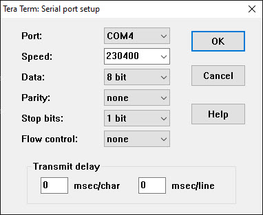

- Connect your USB to TTL debug cable to the RASynBoard using the details below

| Signal | USB to TTL Device | RASynBoard |
|:-------:|:-------------------:|:-----------:|
| `TX/RX`  | `RX` | `TX J5-Pin 1` |
| `TX/RX`  | `TX` | `RX J5-Pin 3` |
| `GDN`    | `GND` | `J5-Pin 13` |

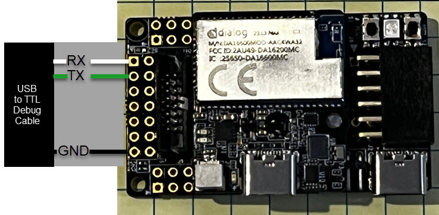

- Apply power to the RASynBoard and observe output from the DA16600 debug UART
    - If you don't see any output verify your connections and com port configuration

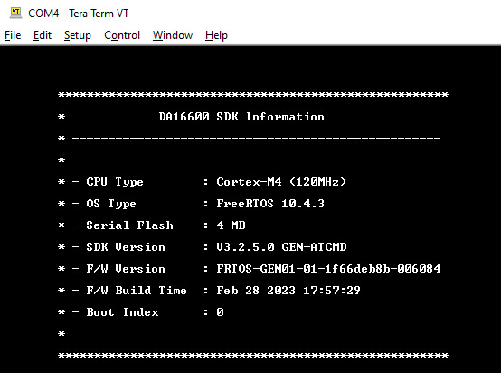

# Flash an image

I downloaded the AWS image.  I took a quick look at other images and they all seem to have the same directory structure in the zip file.  Make sure to use the DA16600_img folder images 

1. Unzip the downlaoded file

- My zip file had a DA16600_img directory with the following files:

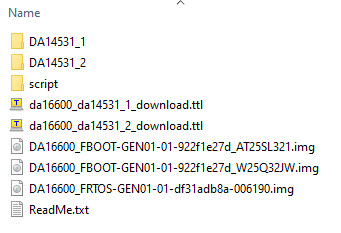

There are two different images in the folder to address two different flash devices that were both used for the DA16600.  Using the details in the **Readme.txt** file I determined that my device contains the **AT25SL321** device.  

## Run the Tera Term Script to Flash the new Image

The download includes Tera Term scripts **(*.ttl)** files.  To run the script and flash the new image onto the DA16600 . . .

1. Verify that your Tera Term Terminal is connected to the DA16600 by hitting the enter key.  This should produce an input prompt.

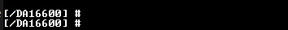

2. In Tera Term select **Control --> Macro** from the pull down menus

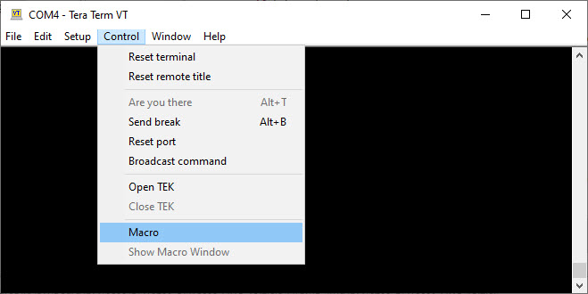

3. The **MACRO: Open macro** file selection window opens
4. Browse to the DA16600_img folder from the zip file you extracted
5. Select the first *.ttl script, then select the **Open** button

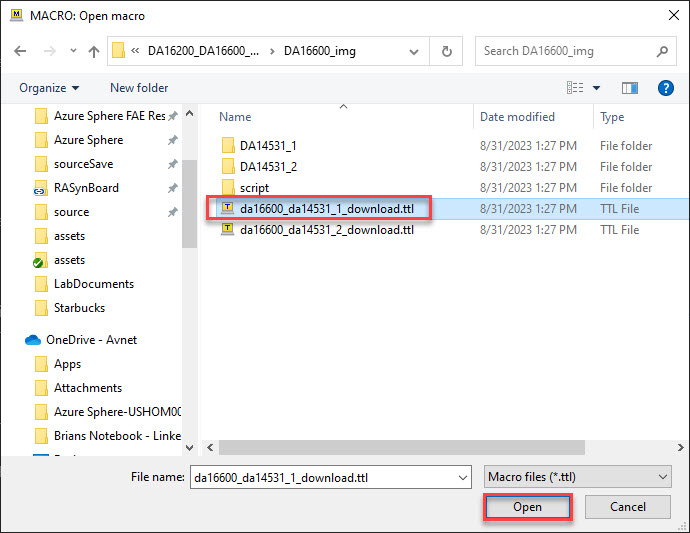

6. The macro displays a dialog asking which type of flash our device has
7. Select the flash type you have on your DA16600, then select open

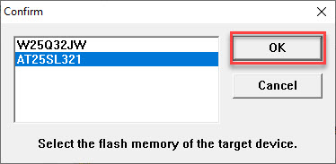

8. The macro runs and downloads three different images . . . 

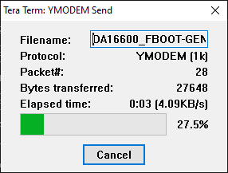
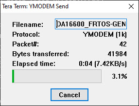
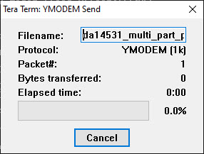

9. Once all the images are transferred, the application outputs the DA16600 SDK Information

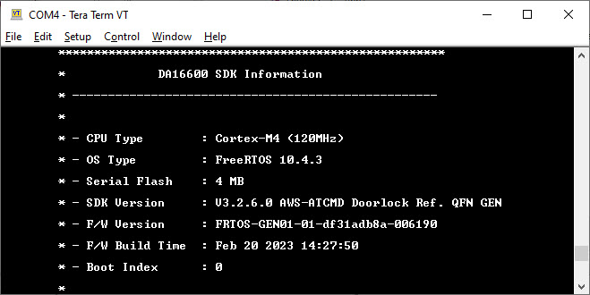

# Conclusion

You should now have a new DA16600 image on your device!

If you have any issues, comments or questions, please open a new issue on the [Repo Issues page](https://github.com/Avnet/RASynBoard-Out-of-Box-Demo/issues)

