# Introduction

One of the things we've done with the Avnet RASynBoard Out-of-Box (OOB) repo is to create tested releases as new features and bug fixes roll out.  Releases are nice if you want to kick the tires without having to install the Renesas e^2 studio and don't care to build the project.

This document walks the user through loading the Avnet Out-of-Box release onto a [RASynBoard EVK](http://avnet.me/RASynBoard)

# RASynbBoard Out-of-Box Releases

Each release . . .
- Includes a version and build date so you can see which release you are running (by examining debug output)
- Includes release notes documenting what changed since the last release
- Documents any known issues and work arounds, if known
- Includes the source code that generated the release
- Includes a zip file **microSD-Files-v\<versionString\>.zip** with all the files that should be copied to the microSD card for the given release
- Credits the developers that contributed to the release

# How to Load a Release onto the RASynBoard EVK

Flashing an image onto the RASynBoard is pretty straight forward.  We need to complete the following steps . . . 

1. Install the Renesas Flash Programmer that we'll use to flash the OOB binary onto the RASynBoard RA6M4
2. Setup the RASynBoard hardware
3. Flash the OOB binary to the RA6M4
4. Copy the release microSD card files to the microSD card

## Prerequisites

- You have an [Avnet RASynBoard EVK](http://avnet.me/rasynboard)
- You have a microSD card for the EVK
- You have a USB-C cable to connect the EVK to your development PC
- You have a [USB to TTL debug cable](https://www.adafruit.com/product/954) to view debug from the OOB application

## Required Software Tools

To load the binary release **AVT-RASynBoard-OOB-v\<versionString\>.srec** to the RASynBoard's RA6M4 MCU you use the Renesas Flash Programmer.  

### Download the Renesas Flash Programmer Installer

1. Open the [Renesas Website](https://www.renesas.com)
2. Either Login with your Renesas account credentials OR Create a free Renesas Account

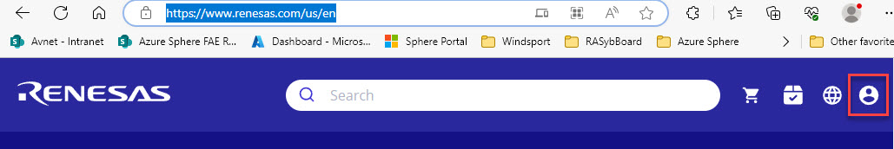

Once you have an account and are logged into to the Renesas system . . . 

4. Download the Renesas Flash Programmer using [this link](http://www.renesas.com/rfp_download)
5. Scroll down to the **Downloads** section
6. Select the installer that matches your development system's OS and architecture

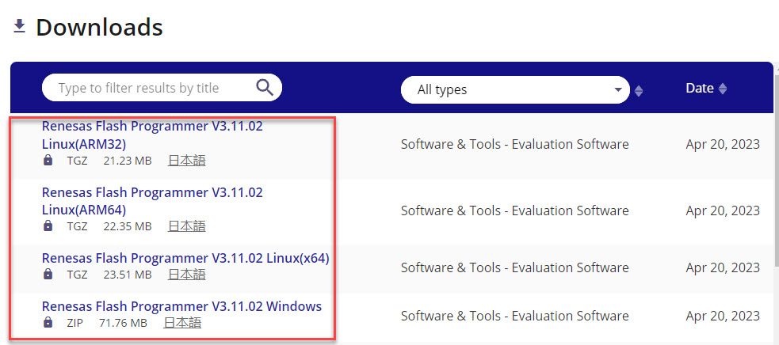

7. Select the **Confirm** link on the **Document Update Notification** pop-up dialog

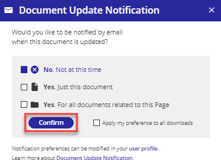

8. Read the disclaimer and select the **Accept and download** link

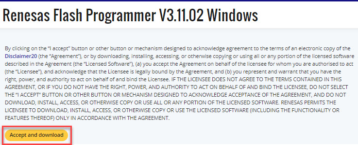

9. The **Renesas_Flash_Programmer_Package_V31102-doc.zip** file is downloaded

### Install the Renesas Flash Programmer Application

1. Unzip the downloaded file and run the **Renesas_Flash_Programmer_Package_V31102.exe** installer
2. Accept any default selections that the installer presents

# Setup the Hardware

1. Verify that jumper **J5** on the Core board is **not present**
2. Remove the jumper on **J3 pins 1-2** on the I/O board, if present
3. Connect a USB-C cable to the USB-C connector on the I/O board as shown below

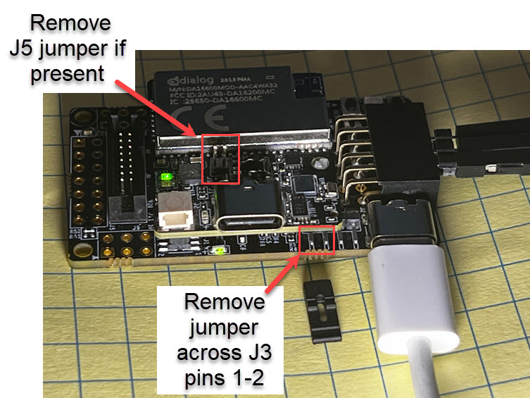
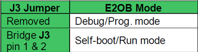

4. Insert the microSD card into the card slot on the underside of the I/O board
5. Connect the USB to TTL debug cable to the PMOD connector as shown below

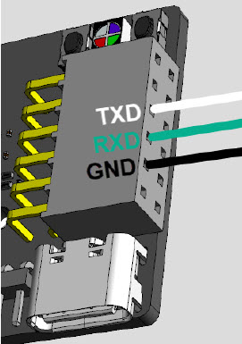

# Download the Latest Avnet OOB Release

1. Navigate to the [OOB Release Page](https://github.com/Avnet/RASynBoard-Out-of-Box-Demo/releases)
2. The latest release will be listed at the top of the page
3. Download the **AVT-RASynBoard-OOB-v\<versionString\>.srec** image by clicking on the link under Assets
4. Download the **microSD-Files-V\<versionString\>.zip** file containing the required microSD card files

# Flash the OOB Application to the RASynBoard

1. Launch the **Renesas Flash Programmer** (version 3.11.02 or later)
2. Select **File --> New Project**, the **Create New Project** dialog opens
3. Use the configuration shown below, click on the **Connect** button

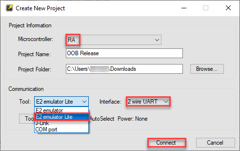

4. Back in the Renesas Flash Programmer main window, you should see that the application connected to your board

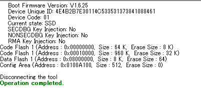

5. Select **Operation** tab
6. In the **Program File** entry click Browse, then select the pre-built binary *.srec file just downloaded
7. Click the large **Start** button to program the selected **\*.srec** file into the RA6M4 MCU

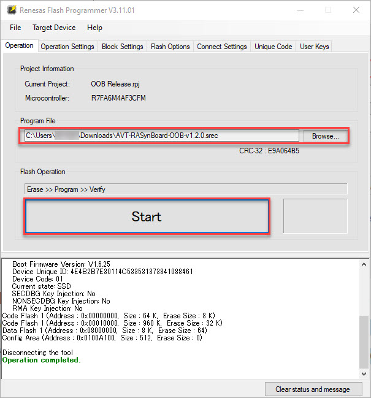

8. The binary image is flashed to the RA6M4 device

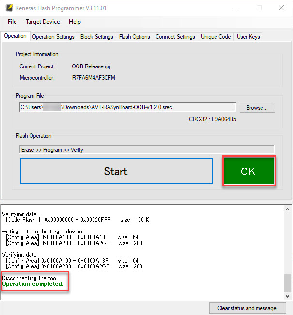

9. Power down RASynBoard by disconnecting the USB cable from the RASynBoard.

# Copy microSD-Files-V\<versionString\>.zip files to the microSD card

1. Fit the 2mm shorting jumper across pins 1 & 2 of J3 on the I/O board
2. Verify that the microSD card is installed on the underside of the I/O board
3. Connect your development PC to the USB-C connector on the core board (NOT the I/O board)
    - Using this USB-C connector will expose the microSD card to the development PC when the OOB application is running

4. Once the application starts up a new USB drive will enumerate on your development PC
5. Unzip the downloaded **microSD-Files-V\<versionString\>.zip** file contents to your microSD card

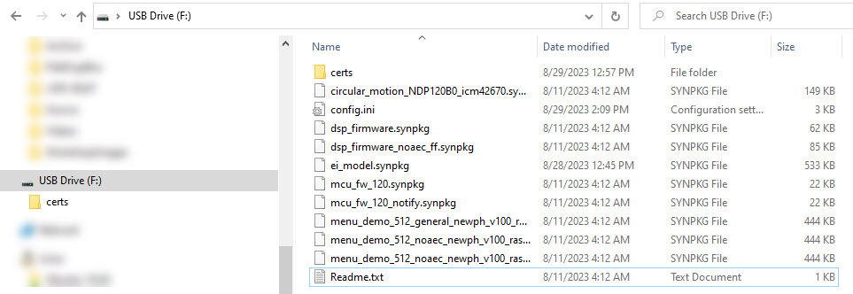

6. Remove and re-insert the microSD card
    - This causes the OOB application to restart and read the new files on the microSD card
7. The application starts and displays the version and release date

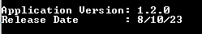

# Next Steps

Now that you have the release installed on your device you can exercise some of the OOB features.

- Exercise some of the features by reviewing the [ML workshop Lab1](http://avnet.me/ML-Workshop-Lab1) document.  
    - Start on the section titled: **Record and Playback and Audio File** found on Page 9
- Explore all the features implemented in the OOB application by reviewing the [RASynBoard Getting Started Guide](RASyBoardGettingStarted.md)

If you have any issues, comments or questions, please open a new issue on the [Repo Issues page](https://github.com/Avnet/RASynBoard-Out-of-Box-Demo/issues)

