# RASynBoard Out of Box Wi-Fi Configuration Options

The RASynBoard Wi-Fi radio is implemented on the DA16600 wireless module.  There are two different ways to configure the Wi-Fi network using the OOB application.  Currently a Wi-Fi connection is required only when using one of the cloud connectivity options.  

This video shows the two different ways to configure the WiFi network on your RASynBoard
- [Video Link (9 minutes)](http://avnet.me/RASynWiFi)
- [Documentation Link](./ApplicationUserGuide.md/#wifi-access-point-configuration-source)

## Use the config.ini configuration file

The config.ini file contains the following items used to configure the Wi-Fi network.  When **Use_Config_AP_Details = 1** the **Access_Point** and **Access_Point_Password** will be used to configure the Wi-Fi Connection.

Restart the OOB application, or remove/insert the microSD card to force the application to use the new configuration items.

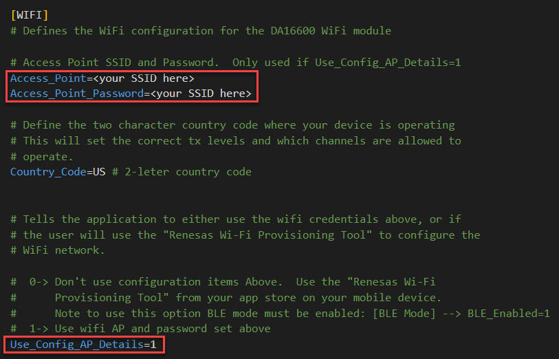

# Use the Renesas Wi-Fi Provisioning Tool from your device's App Store

When using the RASynBoard core board without the I/O board it may be required to configure a new Wi-Fi network.  This can be accomplished by using a free mobile device app from Renesas called the **Renesas Wi-Fi Provisioning Tool.**

## Configure the OOB Application

1. Before separating the core board from the I/O board . . . 
  1. Edit the config.ini file to set **[WIFI] --> Use_Config_AP_Details=0.** 

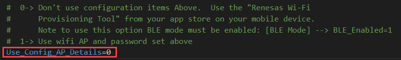

  2. Ensure that **[BLE Mode] --> BLE_Enabled=1.**  This enabled the BLE advertisement feature required to use the Renesas Wi-Fi Provisioning Tool.

  3. Press the user button (button closest to the corner on the I/O board) for > 3 seconds to write the config.ini settings to SPI flash.
  
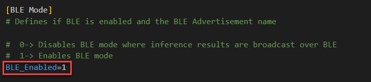

## Install the Renesas Wi-Fi Provisioning Tool

1. Search your app store for **Renesas WiFi**
   1. install the free app onto your device

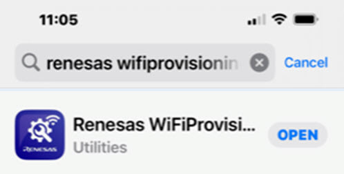

2. When the application opens select the **DA16600 Option**

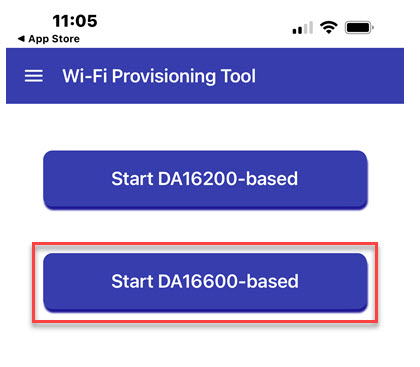

3.  Select the **Start** button at the bottom of the page

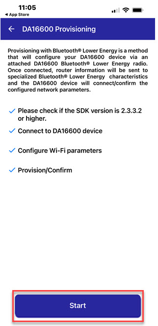

4. Select the **Start Scanning** button to see the BLE devices in the area
   1. Select the **DA16600-wxyz** device to connect to.  Note that the custom BLE name if configured, will not show up in this list; look for a **DA16600-wxyz** device.
   2. If you don't see any **DA16600-wxyz** devices make sure you're not using the Python GUI demo application.  If so, stop the python application and scan again.

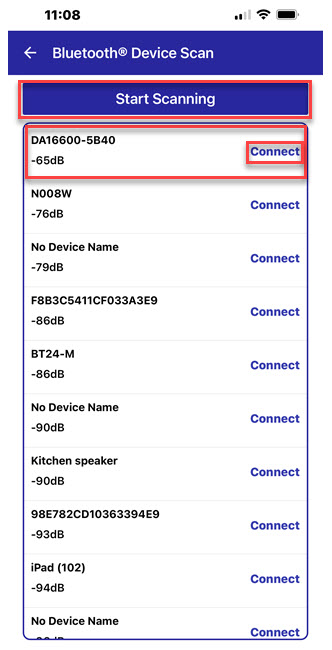

5. Select the **Start Wi-Fi network scan** button

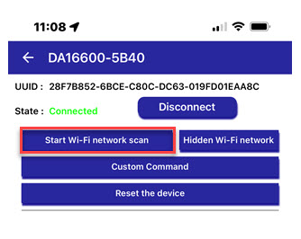

6. All the visible Wi-Fi networks are displayed
   1. Select the network you want to connect to

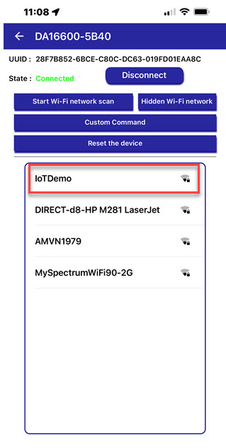

7. Enter the Access Point Wi-Fi password and click **OK**

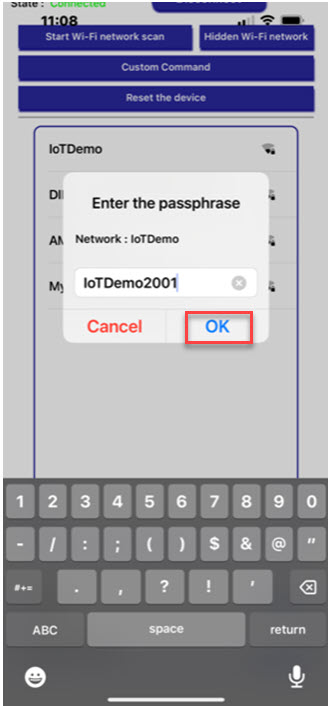

8. The network details are shown.  Select the **Connect to xxx** link at the bottom

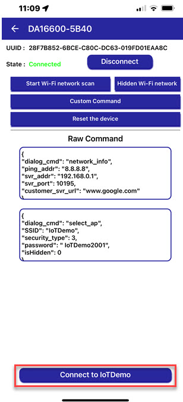

9. The DA16600 connects to the Wi-Fi network!
10. Select **Complete** to close the open dialog

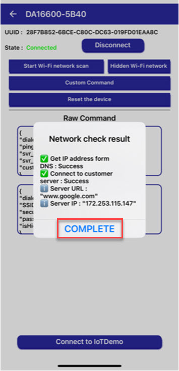

