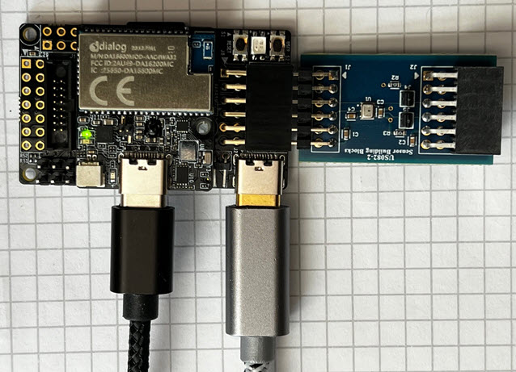
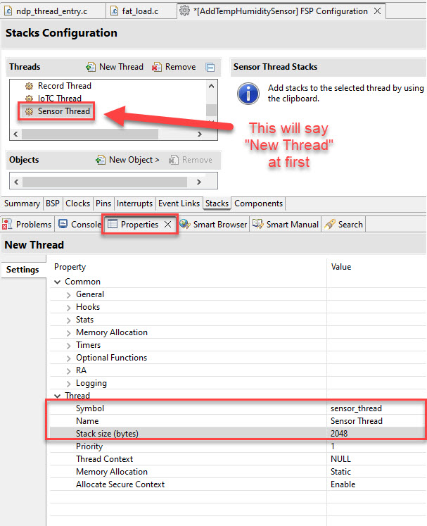
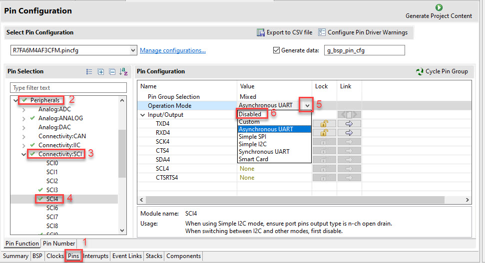
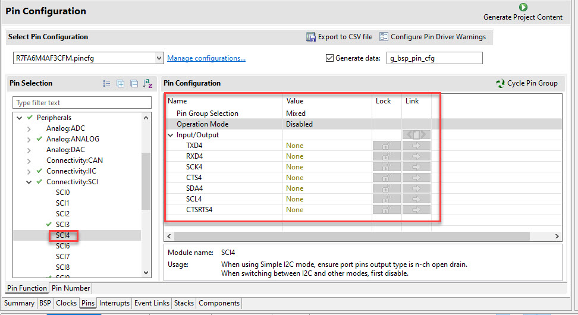
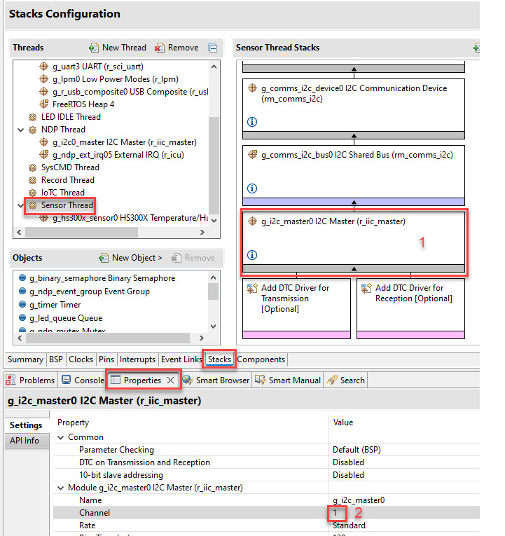

# Introduction

The [Avnet RASynBoard](http://avnet.me/rasynboard) already includes two TDK sensors on the core board; the TDK [ICM-42671-P (6-axis IMU)](https://invensense.tdk.com/products/motion-tracking/6-axis/icm-42670-p/), and the [TDK T5838 (digital MEMS microphone)](https://invensense.tdk.com/products/digital/t5838/).  While these two sensors will support many different ML use cases, adding additional sensors extends the number of use cases that can be addressed. 

This document captures the steps to add the [Renesas US082-HS3001EVZ](https://www.renesas.com/us/en/products/sensor-products/humidity-sensors/us082-hs3001evz-relative-humidity-sensor-pmod-board-renesas-quick-connect-iot) temperature and humidity sensor to the Avnet RASynBoard Out of Box application.  We're going to use the Renesas Flexible Software Package (FSP) to complete the tasks required to add this sensor to the project.  The FSP is a powerful feature that you'll see in action.  

This content does not show how to pass the add-on sensor data to the NDP120 for inferencing.  Look for follow on content that will cover that topic.

Buy links for the hardware:
 - [Avnet RASynBoard](http://avnet.me/rasynboard)
 - [Renesas US082-HS3001EVZ](https://www.renesas.com/us/en/products/sensor-products/humidity-sensors/us082-hs3001evz-relative-humidity-sensor-pmod-board-renesas-quick-connect-iot?partno=US082-HS3001EVZ#modalBuyDirect)


In order to use this PMOD I2C sensor with the Avnet OOB application we need to . . .

1. Clone the project
1. Open the project in the Renesas e^2 Studio IDE
1. Connect the sensor to the RASynBoard
1. Disable the PMOD UART software initialization calls in the project
1. Add a new thread to read the sensor
1. Disable the PMOD debug UART hardware signals (we'll re-use these signals for the I2C interface)
1. Add the I2C interface
1. Add the new sensor drivers
1. Write 10 lines to code to initialize and read the sensor
1. Run the application and verify that the sensor is working

As you'll see the FSP makes this an easy task!

# Clone/Open the Project

First we'll clone the Avnet Out-of-Box application.  I prefer to clone git repos that way I get my source control all setup from the start.  This makes tracking any software changes a breeze.

If you need help getting these steps done, please reference the [RASynBoard Getting Started Guide](./RASyBoardGettingStarted.md).  Once you have built and run the unmodified OOB application come back to this guide.

# Wire the Sensor

Since the RASynBoard has a PMOD connector, we can simply plug in the HS300X sensor to the board.  Use the graphic below to connect your HS300X sensor to your RASynBoard.  



# Modify the Avnet Out of Box application to disable the Debug UART

Since we're going to use the PMOD connector to connect the HS300X device we need to disable application code that assumes that interface is setup for UART Debug.

1. Open ```src/ndp_thread_entry.c```
1. Comment out the ```console_init()``` call


1. Open ```src/fat_load.c```
1. Change ```print_console_type = CONSOLE_USB_CDC```


# Add a new FreeRTOS Sensor Thread

1. Select the **Stacks** tab
1. Click the **New Thread** link


1. Select the **New Thread** in the Threads window
1. Select the **Properties** tab
1. Scroll down to the **Thread** section
1. Update the Thread Symbol to ```sensor_thread```
1. Update the Thread Name to ```Sensor Thread```
1. Set the Thread Stack size (bytes) to ```2048```



The new thread is added to the project, but the (rm_comms_i2c) block is red indicating an issue with the configuration.  You can always hover your mouse over the red error text to see what the issue is with a hint on how to resolve the issue.

1. Select the **Sensor Thread** in the Threads list
1. In the Sensor Thread **Properties** tab under **Common-->General** update the following items . . .  
   - ```Use Mutexes --> Enabled```
   - ```Use Recursive Mutexes --> Enabled```


## Reconfigure the RASynBoard hardware to expose the I2C signals on the PMOD connector

The standard OOB application exposes Debug UART signals on the PMOD, but we need to reconfigure these pins to I2C signals.  The I2C sensor will use these signals from the PMOD connector.

### Disable the Debug UART interface

1. In the IDE open the ```configuration.xml``` file, this opens the FSP Configuration


1. Select the **Pins** tab
1. Select **Peripherals** --> **Connectivity:SCI** --> **SCI4** 
1. Select the pull down control in the **Operation Mode** --> **Value** column
1. Select **Disabled** 



Your SCI4 configuration should look like this . . . 



### Enable the I2C Channel 1 Interface

1. Select the **Pins** tab
1. Select **Peripherals -> Connectivity:IIC -> IIC1**
1. Change the **Operation Mode** to ```Enabled```


### Add and configure the I2C Master block for the new sensor

1. Select the **Stacks** tab
1. With the **Sensor Thread** selected
  1. Click on the **Add I2C Communications Peripheral** block
  1. A **New** option appears
  1. Select **New**
  1. Select **I2C Master (r_iic_master)**


### Select the I2C channel

1. Select the **g_i2c_master0 I2C Master (r_ii2_master)** block 
1. In the Properties tab change the **Channel** to ```1``` to select the I2C interface exposed on the PMOD



# Add the HS300X Driver Code to the project
We'll use the Renesas Flexible Software Package tool to generate all the driver code to read our new sensor.

1. Make sure that the Sensor Thread is selected
1. Select **Stacks** --> **New Stack** --> **Sensor** --> **HS300X Temperature/Humidity Sensor (rm_hs300x)**


## Generate the Project Content

Now it's time for the Flexible Software Package (FSP) Magic

1. In the upper right corner click on the **Generate Project Content** link
1. If prompted to save the changes click **yes** or **Proceed** as appropriate
1. The FSP adds the ```hs300x``` drivers and new ```Sensor Thread``` to your project! 


## Review the FSP generated changes

## HS3000X Drivers

Note that the project now has the hs300x drivers included under the ```ra/fsp/src/rm_hs300x``` directory


## ```sensor_thread_entry()```

If you expand the ```src``` directory you'll see a new file ```sensor_thread_entry.c``` has been added to the project, and furthermore calls were added to call our new thread on startup.  So far we have not written any code but we already have an execution path enabled to read our sensor.  Pretty cool!  Note that the ```sensor_thread_entry.c``` file is pretty sparse!


## Add Initialization code

Usually at this point we would need to dig into documentation to learn how to initialize the I2C interface and read the device datasheet to understand how to interact with the I2C device.  Well the FSP has done all that work for us!  

1. Expand the ```Developer Assistance``` folder
1. Expand the ```Sensor Thread``` folder
1. Add a few blank lines in ```sensor_thread_entry.c``` below the ```#include "sensor_thread.h"``` line


We can add all the initialization code for our device by dragging code from the **Developer Assistance** tree directly into our source file!

1. Using your mouse, drag the following items into the **sensor_thread_entry.c** file


After dragging all the identified items to my **sensor_thread_entry.c** file it was about 270 lines long (your line numbers will be different based on white space)

## Configure the Driver Code

1. Locate the two lines shown below and set the values to ```(1)```

```c
/* TODO: Enable if you want to open HS300X */
#define G_HS300X_SENSOR0_NON_BLOCKING (1)

/* TODO: Enable if you want to use a callback */
#define G_HS300X_SENSOR0_CALLBACK_ENABLE (1)

```

## Populate ```sensor_thread_entry()```

So just like that we have all the driver code done!  

1. Add the standard I/O ```#include <stdio.h>``` at the top of the ```sensor_thread_entry.c``` file


1. Copy and paste the code below overwriting the existing empty ```sensor_thread_entry()``` function

```c
void sensor_thread_entry(void *pvParameters)
{
    FSP_PARAMETER_NOT_USED (pvParameters);

    rm_hs300x_data_t ht_data;
    float g_temp = 0.0f;
    float g_hum = 0.0f;

    g_comms_i2c_bus0_quick_setup();
    g_comms_i2c_device0_quick_setup();
    g_hs300x_sensor0_quick_setup();

    /* TODO: add your own code here */
    while (1)
    {

        g_hs300x_sensor0_quick_getting_humidity_and_temperature(&ht_data);
        g_temp = (float)ht_data.temperature.integer_part + (float)ht_data.temperature.decimal_part / 100.0f;
        g_hum = (float)ht_data.humidity.integer_part + (float)ht_data.humidity.decimal_part / 100.0f;

        // Output the sensor readings.  Note we do not include support for printing
        // floats by default.
        printf("Temp: %d.%dC, Hum: %d.%d%%\n", ht_data.temperature.integer_part,
                                                ht_data.temperature.decimal_part,
                                                ht_data.humidity.integer_part,
                                                ht_data.humidity.decimal_part);

        vTaskDelay (1000);
    }
}
```
# Build the Project

1. Build the project by clicking on the Hammer Icon
1. Run the project in the debugger by clicking on the green bug icon

If you have issues starting the debugger, refer back to the [RASynBoard Getting Started Guide](./RASyBoardGettingStarted.md)


1. Once the debugger is running it will be halted at the call to ```SystemInit()```
1. Press the **F8** key to continue
1. Next the debugger stops at the first line in ```int main(void)```
1. Press the **F8** key to continue

# Change the debug output

Since we highjacked the Debug UART signals for the I2C signals, we need to redirect the application debug to the USB-C connector on the core board (the smaller of the two RASynBoard boards).  We can do this by editing the config.ini file on the microSD card.

1. With the debugger still running . . . 
  1. Connect a second USB-C cable to the USB-C connector on the core board
  1. Open a file explorer window and find the USB drive associated with your RASynBoard
  1. Open the config.ini file in the root directory
  1. Change ```[Debug Print] Port=2``` to select the USB-C connector on the core board for debug output


# Run the Application

1. Stop debugging the application by clicking on the stop button (red square)
1. Restart the application by clicking on the green bug
1. Open the serial port associated with the USB-C cable on the core board
  1. Set the port to 115200, 8,N, 1

You should see debug every second when the sensor data is read


# Conclusion

This document included all the details needed to add the Renesas HS300X temperature and humidity sensor to the Avnet RASynBoard Out-of-Box application.  You got a brief introduction to the Renesas Flexible Software Package and saw how easy it is to add one of the supported sensors to a RA project.

This project is included on the GitHub page under a branch called ```AddTempHumiditySensor```

To pull this branch . . . 
1. ```git clone https://github.com/Avnet/RASynBoard-Out-of-Box-Demo.git```
1. ```git checkout AddTempHumiditySensor```

If you have any questions, issues or comments on this content please open a new issue on the GitHub page!