# AWS IoT Core Instructions

This document includes all the details required to connect your device to AWS and send/receive MQTT data.  The document captures all the details to . . . 

1. Sign up for a free AWS account
1. Create a new IoT Core device in AWS
1. Configure the Avnet Out-of-Box (OOB) application to connect to AWS
1. Run the demo and verify that inference data is sent to AWS as telemetry

# Prerequisites

1. You have an [Avnet RASynBoard EVK](http://avnet.me/rasynboard)
1. You have a microSD card for the EVK
1. You have a USB-C cable to connect the EVK to your development PC
1. You have completed the [RASynBoard Getting Started Guide](./RASyBoardGettingStarted.md)
1. You have exercised the **5-keyword ML model "up", "down", "back", "next", "ok-syntiant"**
1. You have a [USB to TTL debug cable](https://www.adafruit.com/product/954) to view debug from the OOB application

# Sign up for a Free AWS Account

You'll need an AWS account to complete these instructions.  If you already have an account sign into the AWS console.  If not,
AWS provides a free tier that will provide all the services we need to connect our device to AWS and send/receive data.

**Note** the free account does require that you enter a credit card number

- Navigate to the [AWS account sign up page](https://aws.amazon.com/free)
- Follow the sign up process.  If you have any questions, you can refer to [this AWS document](https://repost.aws/knowledge-center/create-and-activate-aws-account) on the process

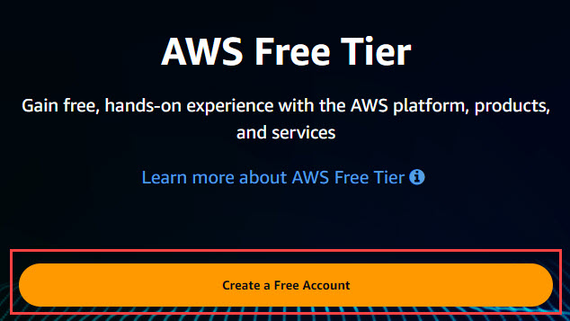

- Once you've completed the sign up process login to the AWS Console

# Create a New Device

1. Select the **IoT Core** link

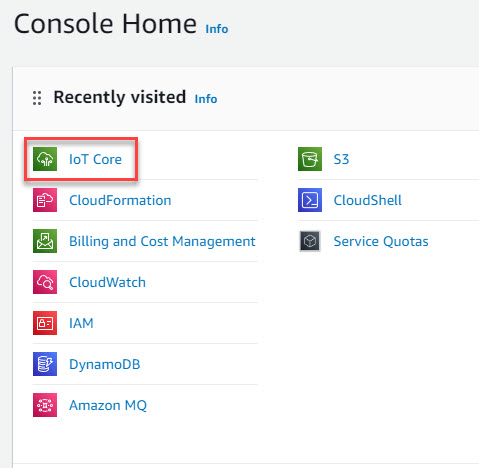

2. On the left side menu, select **Manage --> Add devices --> Things** 
3. Click on the **Create things** button

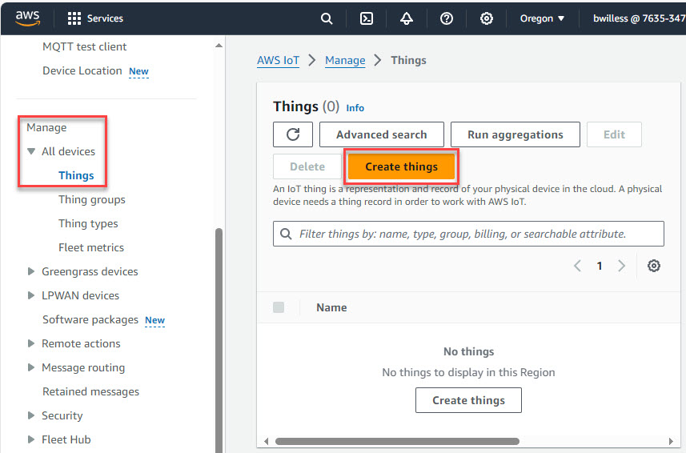

4. Select **Create single thing**
5. Select the **Next** button 

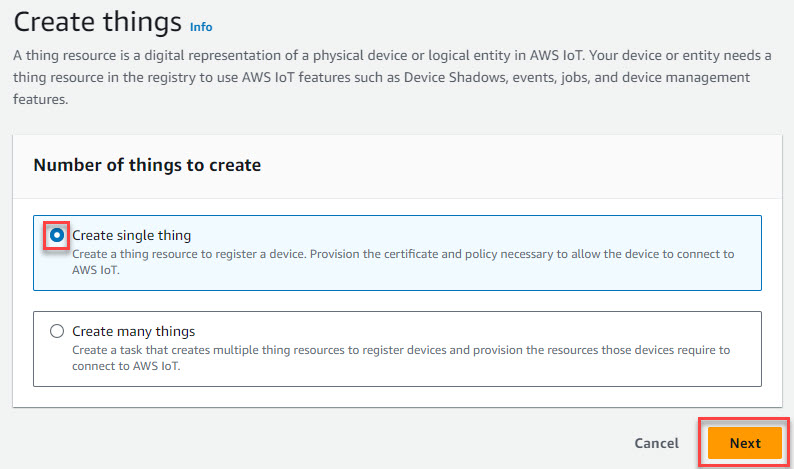

6. Give you thing a name
7. Select the **Next** button

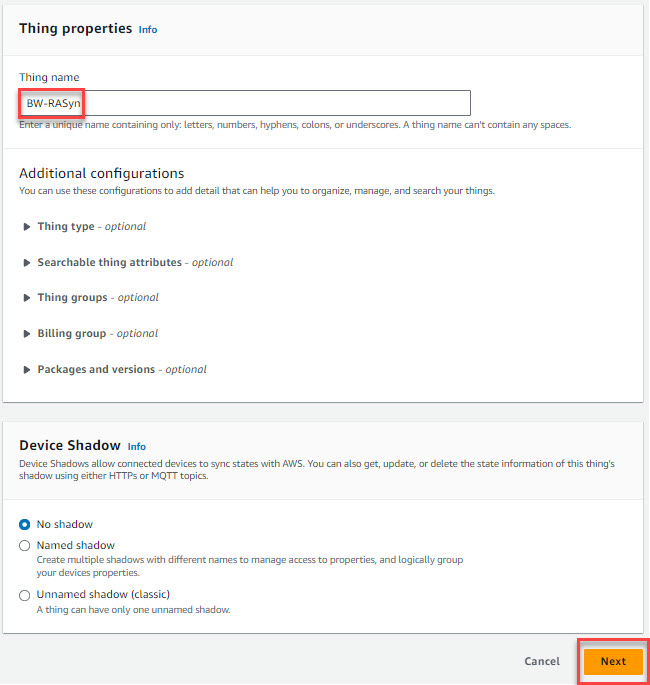

8. Select **Auto-generate a new certificate (recommended)**
9. Select the **Next** button

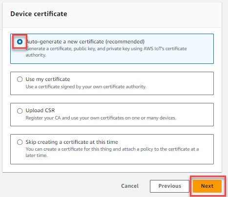

10. Click on the **Create policy** button

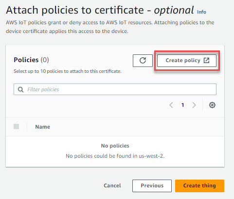

11. Give your policy a name
12. Add the 4 policies shown below, use the **Add new statement** button to add the additional policy lines
    - Note that we're providing a wildcard **\*** for the Policy resource.  This is *NOT* a best practice!
13. Click the **Create** button

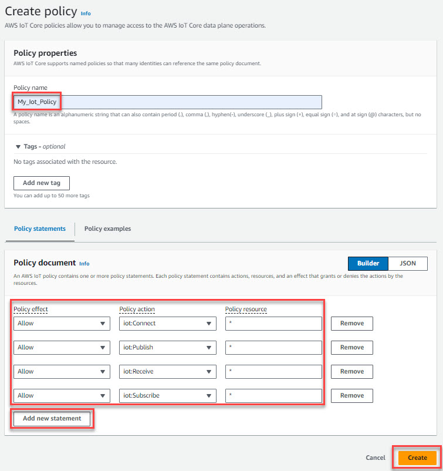

14. Your new policy is created
15. **Verify that the check box next to the policy is selected!**
16. Click the **Create thing** button to finish the process

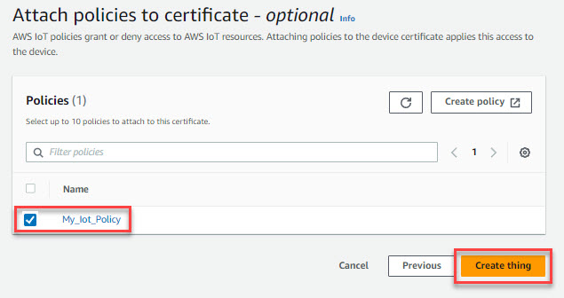

# Download the device certificates

1. Once your device has been created the interface will open the **Download certificates and keys** dialog

**Note** This is the only time you can download the key files for the device!

2. Using the **Download** buttons download the 
   1. Device certificate
   2. Public key file
   3. Private key file
3. Once you have downloaded the certificates, click the **Done** button

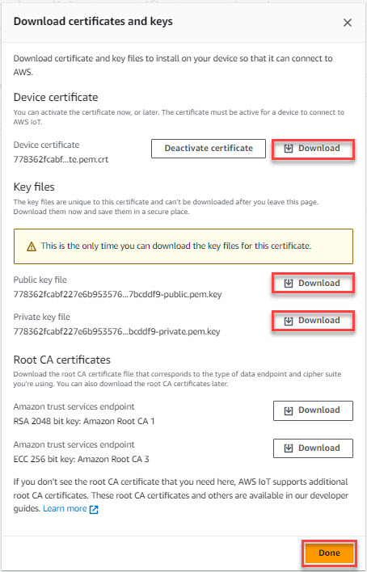

## Rename your certificates
Notice that the certificate names are not very meaningful.  As a best practice I like to rename my certs after the thingName

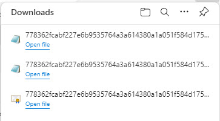

1. Open your downloads folder and replace the long number with the thingName to each of the certs we just downloaded

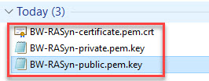

# Checkpoint

So far we have . . . 

- Signed up for an free AWS account, or logged into our existing account
- Created a new IoT Core **Thing**
    - Created a security policy allowing our thing to connect to AWS
- Downloaded the Thing certificate and keys

# Update the Avnet Out-of-Box application with details for our new device

At this point it's important that all the prerequisites detailed at the top of this document have been completed.  Please review them and make sure you're ready to proceed.

## Collect required details to connect our device to AWS

There are two AWS details we need to configure the OOB application to connect to AWS IoT Core.  We'll add them to the config.ini file on the RASynBoard microSD card.  I recommend opening up a text document to capture these items.   

### Device Unique ID 

1. The Unique ID can be found on the **Manage --> All devices --> Things** page
2. In my case it's **"BW-RASyn"**

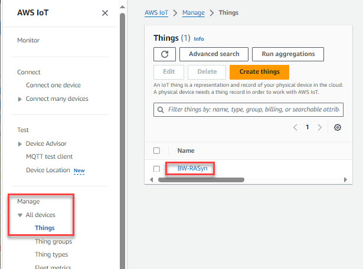

### Endpoint URL
The endpoint url is used by the RASynBoard firmware to establish the MQTT over TLS connection.

1. From the AWS IoT page, select the **Settings** link at the left towards the bottom of the list
2. Note the **Endpoint** FQDN 

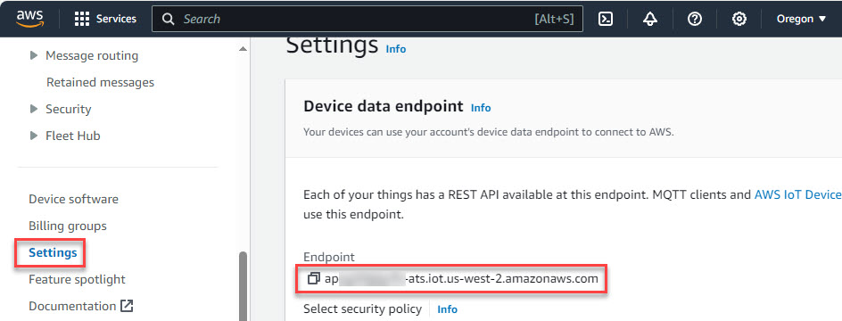

# Configure the Avnet Out-of-Box application

We're getting close now!  The next step is to configure the OOB application by adding the device certificates and updating the config.ini file that's located on the microSD card.  Since you already completed the [RASynBoard Getting Started Guide](./RASyBoardGettingStarted.md) you updated your microSD card with all the files from the /ndp120/synpkg_files/* folder.  

## Copy the Device Certificates to the microSD card

1. Copy the device certificate and the private key certificate files to the microSD card into the /certs directory
1. The certs directory should already contain the AmazonRootCA1.pem file, if not copy it from the repo /ndp120/synkpg_files/certs folder

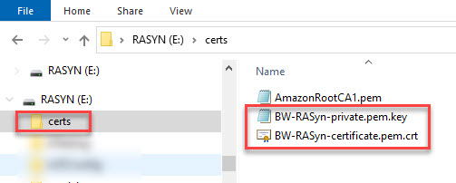

## Update the Config.ini file

1. Open the config.ini file by either removing the microSD card from the RASynBoard and using a microSD card reader, or by running the OOB application and connecting your USB-C cable to the USB-C connector on the core board.

If you use the RASynBoard OOB application . . . 

1. Make sure the OOB application is loaded onto the device (if you completed the [RASynBoard Getting Started Guide](./RASyBoardGettingStarted.md) this is done)
1. Make sure that the Jumper is installed on J3 across pins 1-2 (this will auto boot the application)
1. Connect your development PC to the USB-C connector on the core board (NOT the I/O board)

Once the application boots, the microSD card will enumerate on your development PC as an external USB drive

1. Update the following items in your config.ini

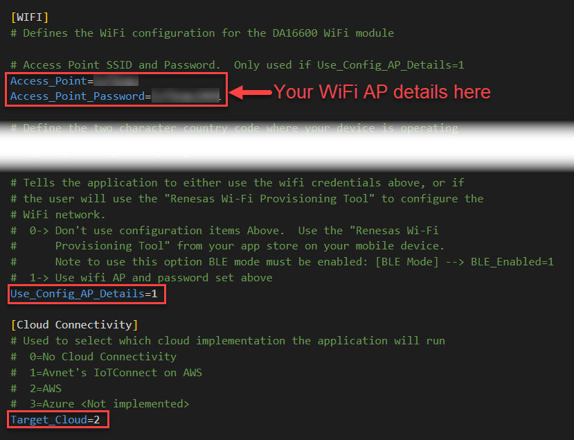
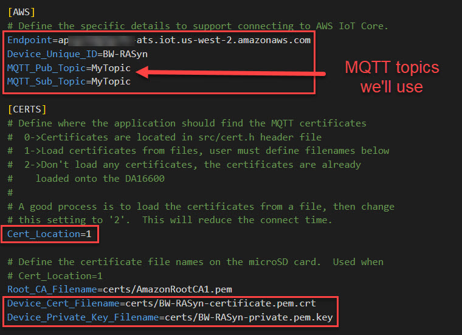

# Run the demo

Now that everything is configured, we can run the demo!  Cycle power on the device by disconnecting/reconnecting the USB-C connector from your development PC.

1. **Note**: When the application starts up it outputs the configuration so you can confirm that your settings are being used . . .

2. **Note**: The debug will show the different states that the IoTConnect thread processes while connecting to AWS.  If your device does not connect watch the debug for **ERROR** debug messages.

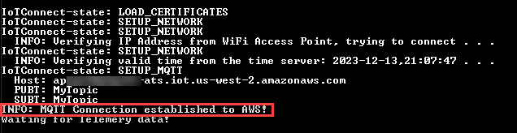

The OOB application implements a queue for telemetry data.  This way if telemetry data is generated before the application is connected to AWS, the message is not lost.  As soon as the MQTT connection is established the IoTConnect thread looks for messages in the queue and if present they get sent to AWS!  Additionally, the application verifies that there is a valid MQTT connection before sending any telemetry.  If not, the state machine is rolled back to re-establish the MQTT connection.

## Send Telemetry

The application sends inference data up as telemetry each time there is an inference event.  

1. Speak one of the keywords **"up"**

    - The NDP120 detects the keyword and interrupts the OOB application running on the RA6
    - The OOB application constructs JSON with the inference data and sends an MQTT message on the "MyTopic" publish topic
    - AWS receives the MQTT message and since the device is subscribed to the "MyTopic" topic, AWS sends it back to the device
    - The device receives the message and outputs it to debug.

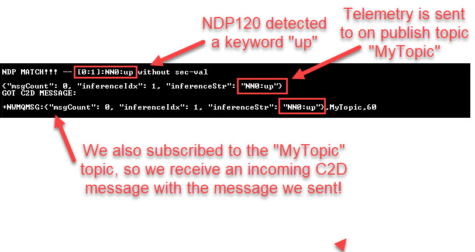

2. Now go back to the AWS console
3. Select **Test --> Device Advisor --> MQTT test client**
4. Select the **Subscribe to a topic** tab
5. Enter **"MyTopic** in the Topic filter input box
6. Click the **Subscribe** button

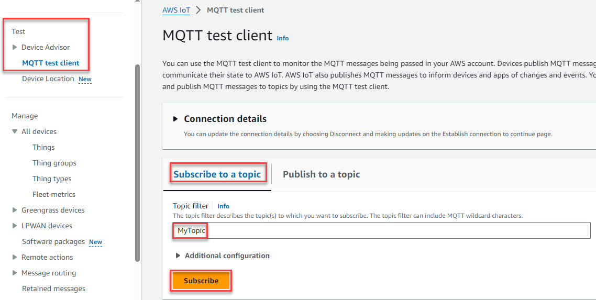

7. Speak one of the keywords again **"OK-Syntiant"**
8. Note that the MQTT Test Client receives the inference JSON that the application sent

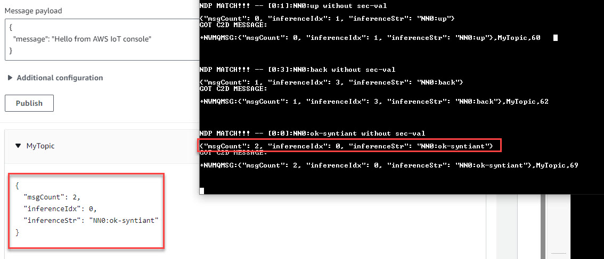

9. Click on the **Publish** button to send the hello message
10. Note that the hello message is received by the device

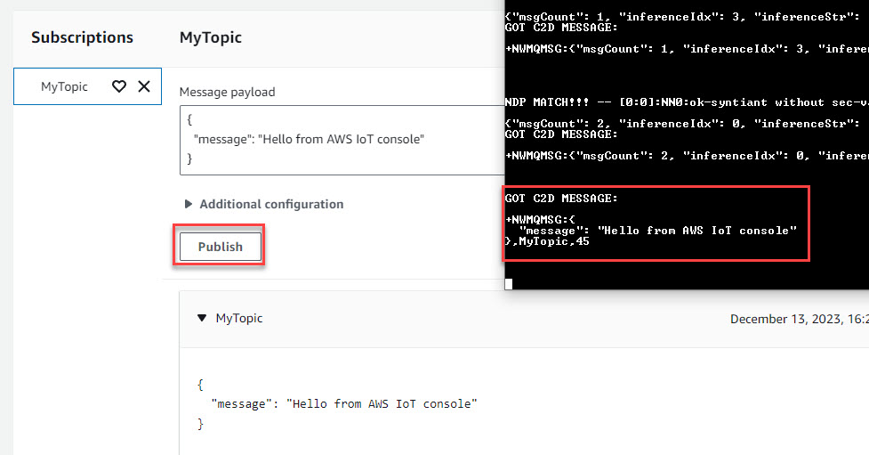

# Conclusion

The ability to send and receive data to AWS opens lots of different use cases.  In the coming weeks, I'll add logic to the OOB application to parse incoming messages to do things like control an LED, or update a configuration value on-the-fly.

I hope you were successful in sending/receiving data to AWS.  If you encounter any issues or have questions feel free to [open an issue in the repo](https://github.com/Avnet/RASynBoard-Out-of-Box-Demo/issues)

