# Avnet RASynBoard Out-Of-Box Application

The Out-of-Box (OOB) application's goal is to "Provide a working example application that exercise the RASynBoard hardware and gives development teams a strong starting point for their own custom designs and ML training data"

## Application Errata

Please refer to the [Release Notes](./releaseNotes.md) for details on known issues with this release

# Getting Started

This section includes details on how to clone, configure, build, and load the OOB application onto your RASynBoard Hardware

## Tools

To build and run the OOB application you need the install the Renesas e^2 Studio and an optional but recommended terminal application such as TeraTerm

1. Renesas e^2 Studio: [Link](https://www.renesas.com/us/en/software-tool/e-studio)
1. TeraTerm: [Link](https://osdn.net/projects/ttssh2/releases/)

## Clone, Configure, Build, Debug . . . 

### Clone the Project

1. Clone this repo: ```git clone https://github.com/Avnet/RASynBoard-Out-of-Box-Demo.git```
1. Note, if you clone the project to a custom folder name, you'll need to configure your debugger settings as detailed later in this document
   1. ```git clone https://github.com/Avnet/RASynBoard-Out-of-Box-Demo.git myCustomFolderName```

### Configure the Project

1. Launch the Renesas e^2 Studio
1. Create a new workspace by browsing to the directory for your new workspace *I usually create a workspace folder at the same level as my cloned code base*
   1. Click "Launch"

   1. 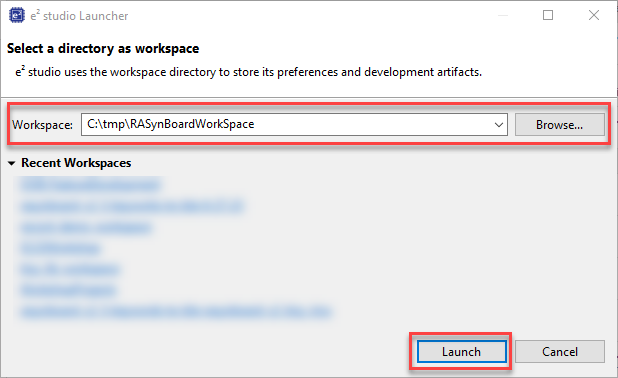
1. e^2 Studio Launches and presents the Welcome Screen
1. Select the "Import existing projects" option
   
   1. 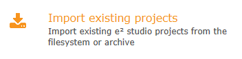
1. The "Import Projects" dialog is displayed
1. Use the "Browse..." button to browse the file system, select the cloned project directory
1. Leave all the option at the default state
1. Click the "Finish" button
   
   1. 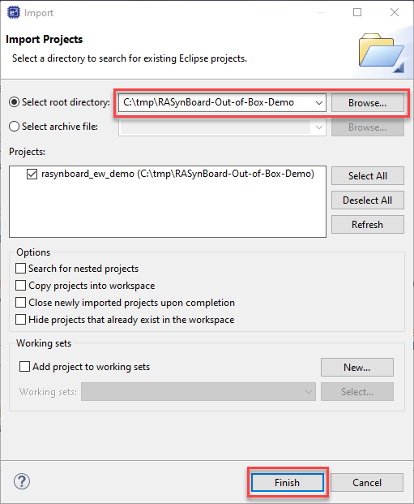
1. The project is imported into e^2 Studio
1. Next we'll generate the "Flexible Software Package" (FSP) code
   1. Expand the project file tree in the "Project Explorer" window at the left side
   1. Double click on "configuration.xml" to open the FSP explorer
   
      1. 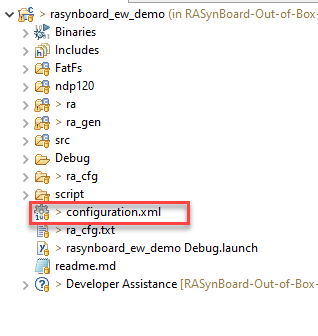
      1. If a dialog opens complaining about the current version of FSP installed, just accept the new version
   
      1. 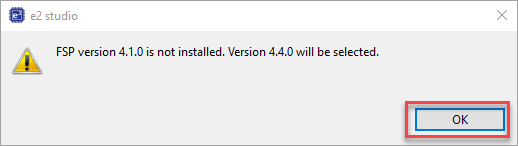
   1. The Stacks Configuration tab opens
   1. Click on the "Generate Project Content" link in the upper right hand corner
   1. The "Generate Project Content" dialog opens, select the "Proceed" button
   1. The project content is generated
   
      1. 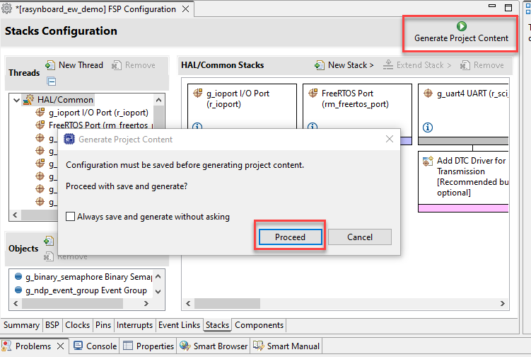

### Build the Project 

1. From the pull down menus select Project -> Build All or use the Ctrl+Alt+B keyboard shortcut

1. 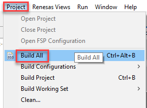
1. The project builds and generates output files in the Debug Directory
   1. In the build directory we can see the output files.  Two files we're interested in are . . 
      1. rasynboard_ew_demo.elf.  This is the file we'll load with the debugger
      1. reaynboard_ew_demo.srec. This is the file we can distribute and side-load onto RASynBoard hardware using the Renesas Flash Programmer application

### Setup the Hardware

1. If you have a USB to TTL serial cable, connect it to the PMOD connector as shown below

1. 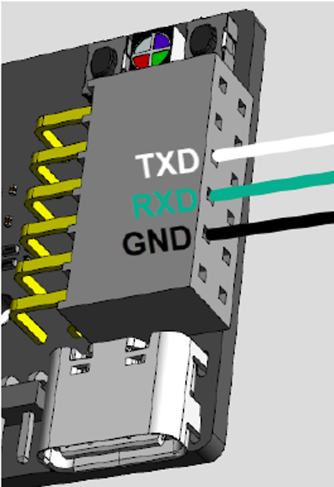
1. Verify that jumper J5 on the Core board is not present

1. 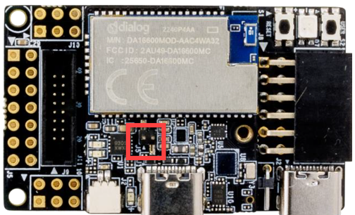
1. Remove the jumper on J3 pins 1-2 on the IO board, if present

1. 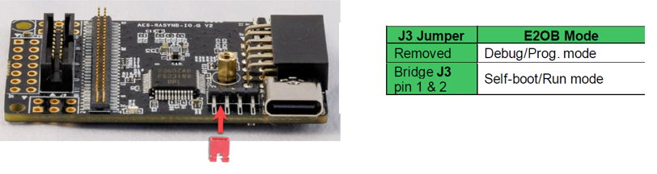
1. Connect a USB-C cable between your development PC and the IO board as shows below

1. 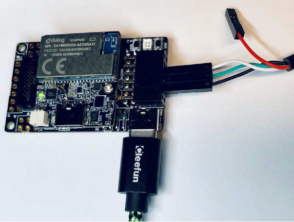

### Copy NDP120 Files to your microSD card

The microSD card on the IO Board is used to store the NDP120 images and a config.ini file that we can use to change the behavior of the OOB Demo application

1. Copy all the files from the project directory \ndp120\synpkg_files directory to the root directory of your microSD card
1. Insert the microSD card into the RASynBoard IO Board microSD cage on the bottom of the board

### Debug the project

Now we can load and run the project on the RASynBoard!

1. Click on the green bug icon in the toolbar
1. If a dialog opens up confirming the Perspective Switch, select the "Switch" button
1. If you see a dialog like the one shown below, then you likely cloned the project into a custom folder name.  Not a big deal, we can fix it

   1. 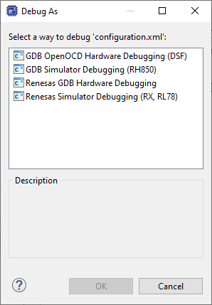
   1. Hit the "Cancel" button to exit the "Debug As" dialog
   1. Right click on the top level folder of your project and select "Debug As" --> "Debug Configuration . . ."

   1. 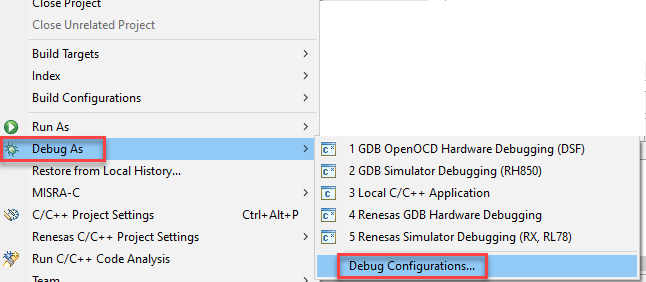
   1. Select the "Renesas GDB Hardware Debugging", then select the "Debugger" Tab, then change the "Target Device" to "R7FA6M4AF", then "Apply", then close

   1. 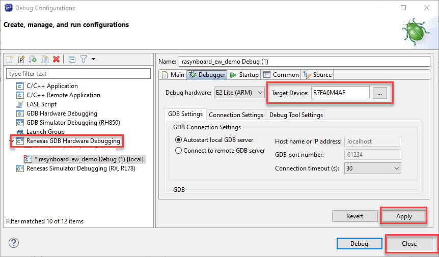
   1. Now start the debugger by clicking on the green bug icon in the toolbar
1. 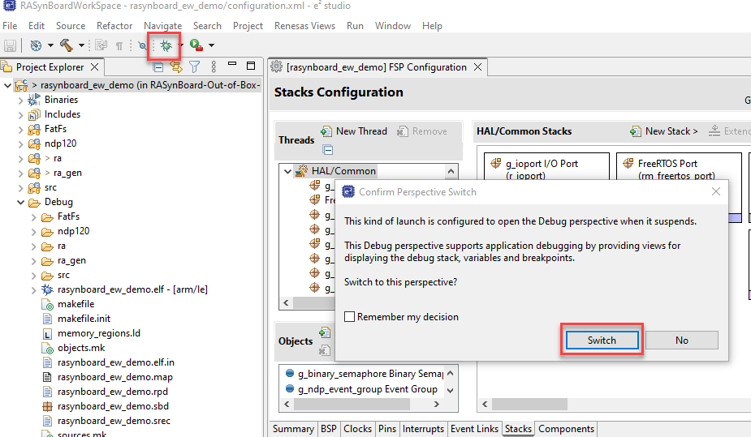
1. The application is transferred to the board
1. Application execution stops at the call to "SystemInit()"
   1. Press the F8 key to resume execution
1. Application execution stops at the first line in the main() function
   1. Press the F8 key to resume execution
1. The application starts up and outputs debug showing the device loading the NDP120 images from the microSD card

### Setup the board to automatically load the application

Now that the application is on your RASynBoard, we can close the Renesas e^2 studio and run the application by just applying power to the USB-C connector.

1. Disconnect the USB-C cable from your PC to power the device off
1. Insert the jumper on J3 across (shorting out) pins 1-2 on the IO board

1. 
1. Connect the USB-C cable back to your PC to power up the device
1. The device boots and runs the OOB application!

# Exercise the application
The OOB application implements lots of different features.  This section walks the user through the main feature set.

## Keyword detection

The default model on the microSD card detects 5-keywords

1. Speak each of the keywords, monitor the RGB LED and the terminal output when a keyword is detected
   1. up
   1. down
   1. back
   1. next
   1. ok syntiant
1. If you speak "down down" with a pause in the middle the device will enter a low power state
   1. The RA6M4 MCU will be in a low power state
   1. The NDP120 is still sampling audio data through the digital mic
   1. Speak any of the keywords
      1. The NDP120 detects the keyword, and asserts a gpio signal to wake up the RA6M4

1. 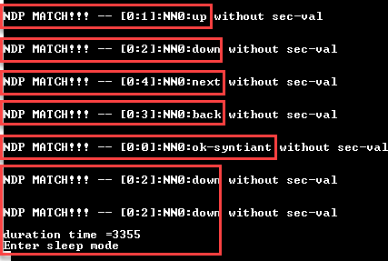

## Record Training Data to microSD card

Another nice feature is the ability to record training data from the on-board sensors.  The OOB application can record either audio data, or IMU sensor data.  The default configuration records audio data.

Once the audio file is on your microSD card you can upload the file(s) to Edge Impulse Studio where you can use the data to train your own keyword recognition ML model!

1. Press the user button (button closest to the corner of the IO board) for < 400ms
   1. The green LED lights up indicating that audio is being recorded
   1. Note no inferencing will be performed while recording audio
   1. Once the recording stops, the green LED will extinguish
   1. Remove the microSD card from the board and use your PC to listen the audio file

